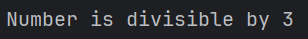

# Control Flow

Bir koşulun doğru olup olmamasına bağlı olarak bazı kodları çalıştırma ve bir koşul doğruyken bazı kodları tekrar tekrar
çalıştırma yeteneği, çoğu programlama dilinde temel yapı taşlarıdır. Rust kodunun yürütme akışını kontrol etmenizi
sağlayan en yaygın yapılar if Expression'ları ve döngülerdir.

### If expressions

Bir if Expressionsi, koşullara bağlı olarak kodunuzu dallara ayırmanıza olanak tanır. Bir koşul sağlarsınız ve
ardından "Bu
koşul karşılanırsa, bu kod bloğunu çalıştırın. Koşul karşılanmazsa, bu kod bloğunu çalıştırmayın.

````
fn main() {
    let number = 3;

    if number < 5 {
        println!("Condition was true");
    } else {
        println!("Condition was false")
    }
}
````

Tüm if Expression'ları if anahtar kelimesiyle başlar ve ardından bir koşul gelir. Bu durumda koşul, sayı değişkeninin
5'ten küçük bir değere sahip olup olmadığını kontrol eder. Koşul doğruysa çalıştırılacak kod bloğunu, koşuldan hemen
sonra küme parantezleri içine yerleştiririz. If Expression'larındeki koşullarla ilişkili kod bloklarına bazen "arms" adı
verilir

İsteğe bağlı olarak, koşulun yanlış olarak değerlendirilmesi durumunda programa yürütülecek alternatif bir kod bloğu
vermek için burada yapmayı seçtiğimiz gibi bir else expression'ı da ekleyebiliriz. Bir else expression'ı sağlamazsanız
ve koşul yanlışsa, program if bloğunu atlayacak ve bir sonraki kod parçasına geçecektir.

Ayrıca, bu koddaki koşulun bir bool olması gerektiğini de belirtmek gerekir. Eğer koşul bir bool değilse, bir hata
alırız. Örneğin, aşağıdaki kodu çalıştırmayı deneyin:

````
fn main() {
    let number = 3;

    if number {
        println!("Condition was true");
    } else {
        println!("Condition was false")
    }
}
````

Hata, Rust'ın bir bool beklediğini ancak bir tamsayı aldığını gösterir. Ruby ve JavaScript gibi dillerin aksine, Rust
Boolean olmayan türleri otomatik olarak Boolean'a dönüştürmeye çalışmaz. Açık olmalı ve her zaman koşul olarak bir
Boolean ile if sağlamalısınız. Örneğin, if kod bloğunun yalnızca bir sayı 0'a eşit olmadığında çalışmasını istiyorsak,
if Expressionsini aşağıdaki gibi değiştirebiliriz:

````
fn main() {
    let number = 3;

    if number != 0 {
        println!("Number was something other than zero")
    }
}
````

Bu kodun kullanılmaması, sayının sıfırdan farklı bir şey olduğunu yazdıracaktır.

### Birden Fazla Koşulu else if ile İşleme

Bir else if Expression'ının da if ve else öğelerini birleştirerek birden fazla koşul kullanabilirsiniz. Örneğin:

````
fn main() {
    let number = 6;

    if number % 4 == 0 {
        println!("Number is divisible by 4");
    } else if number % 3 == 0 {
        println!("Number is divisible by 3");
    } else if number %2 == 0 {
        println!("Number is divisible by 2");
    } else {
        println!("Number off not divisible by 4,3 or 2");
    }
}
````

Bu programın izleyebileceği dört olası yol vardır. Çalıştırdıktan sonra aşağıdaki çıktıyı görmelisiniz:



Bu program çalıştığında, her bir if Expression'ini sırayla kontrol eder ve koşulun doğru olarak değerlendirildiği ilk
gövdeyi çalıştırır. 6'nın 2'ye bölünebilir olmasına rağmen, çıktı sayısının 2'ye bölünebilir olduğunu görmediğimize veya
else bloğundan sayının 4, 3 veya 2'ye bölünemez olduğunu görmediğimize dikkat edin. Bunun nedeni, Rust'ın bloğu yalnızca
ilk doğru koşul için çalıştırması ve bir tane bulduğunda diğerlerini kontrol etmemesidir.

Çok fazla else if Expression'i kullanmak kodunuzu karmaşık hale getirebilir, bu nedenle birden fazla else if
Expression'iniz varsa kodunuzu yeniden düzenlemek isteyebilirsiniz. Bölüm 6, bu durumlar için match adı verilen güçlü
bir Rust branching yapısını açıklamaktadır.

### let Deyimi İçinde if Kullanma

if bir Expression olduğundan, Liste 3-2'de olduğu gibi, sonucu bir değişkene atamak için let deyiminin sağ tarafında
kullanabiliriz.

````
fn main() {
    let condition = true;
    let number = if condition {5} else {6};

    println!("Number : {number}")
}
````

Sayı değişkeni, if Expression'inin sonucuna bağlı olarak bir değere bound olacaktır. Ne olacağını görmek için bu kodu
çalıştırın:


Kod bloklarının içlerindeki son Expressio'a göre değerlendirildiğini ve sayıların da kendi başlarına birer Expression
olduğunu unutmayın. Bu durumda, if Expression'inin tamamının değeri hangi kod bloğunun yürütüleceğine bağlıdır. Bu,
if'in her bir arm'ının sonucu olma potansiyeline sahip değerlerin aynı türde olması gerektiği anlamına gelir; Liste
3-2'de, hem if arm'ının hem de else arm'ının sonuçları i32 tamsayılarıdır. Aşağıdaki örnekte olduğu gibi türler
uyuşmazsa, bir hata alırız:

````
fn main() {
    let condition = true;
    let number = if condition { 5 } else { "six" };
    println!("The value of number is: {number}");
}
````

Bu kodu derlemeye çalıştığımızda bir hata alacağız. if ve else arms'ları uyumsuz değer türlerine sahiptir ve Rust,
programdaki sorunu tam olarak nerede bulacağımızı gösterir:

````
$ cargo run
   Compiling branches v0.1.0 (file:///projects/branches)
error[E0308]: `if` and `else` have incompatible types
 --> src/main.rs:4:44
  |
4 |     let number = if condition { 5 } else { "six" };
  |                                 -          ^^^^^ expected integer, found `&str`
  |                                 |
  |                                 expected because of this

For more information about this error, try `rustc --explain E0308`.
error: could not compile `branches` due to previous error
````

if bloğundaki Expression bir tamsayı olarak değerlendirilir ve else bloğundaki Expression bir String olarak
değerlendirilir. Bu işe yaramaz çünkü değişkenler tek bir türe sahip olmalıdır ve Rust'ın derleme sırasında number
değişkeninin türünü kesin olarak bilmesi gerekir. Sayının türünü bilmek, derleyicinin sayıyı kullandığımız her yerde
türün geçerli olduğunu doğrulamasını sağlar. Sayının türü yalnızca runtime da belirlenseydi Rust bunu yapamazdı;
derleyici daha karmaşık olurdu ve herhangi bir değişken için birden fazla varsayımsal türü takip etmek zorunda kalırsa
kod hakkında daha az garanti verirdi.

### Looplarla tekrarlama

Bir kod bloğunu birden fazla kez çalıştırmak genellikle yararlıdır. Bu görev için Rust, döngü gövdesi içindeki kodu
sonuna kadar çalıştıracak ve ardından hemen baştan başlayacak birkaç döngü sağlar.

Rust'ta üç tür döngü vardır: loop, while ve for. Her birini deneyelim.

* Loop ile Kod Tekrarı

Loop anahtar sözcüğü Rust'a bir kod bloğunu sonsuza kadar veya siz açıkça durmasını söyleyene kadar tekrar tekrar
çalıştırmasını söyler.

Örnek olarak, src/main.rs dosyasını aşağıdaki gibi değiştirin:

````
fn main() {
    loop {
        println!("infinity loop");
    }
}
````

Bu programı çalıştırdığımızda, programı manuel olarak durdurana kadar sürekli olarak tekrar tekrar yazdırıldığını
göreceğiz. Çoğu terminal, sürekli bir döngüde takılı kalan bir programı kesmek için ctrl-c klavye kısayolunu destekler.

Neyse ki Rust, kod kullanarak bir loopdan çıkmak için de bir yol sunar. Programa döngüyü yürütmeyi ne zaman
durduracağını söylemek için döngü içine break anahtar sözcüğünü yerleştirebilirsiniz. Kullanıcı doğru sayıyı tahmin
ederek oyunu kazandığında programdan çıkmak için Bölüm 2'deki "Doğru Tahminden Sonra Çıkmak" bölümündeki tahmin oyununda
bunu yaptığımızı hatırlayın.

Tahmin oyununda ayrıca, bir loop'da programa loop'un bu iteration'ının da kalan tüm kodları atlamasını ve bir sonraki
loop'a geçmesini söyleyen continue Expression'ini kullandık.

* Döngülerden Değer Döndürme :

Döngünün kullanım alanlarından biri, bir iş parçacığının işini tamamlayıp tamamlamadığını kontrol etmek gibi başarısız
olabileceğini bildiğiniz bir işlemi yeniden denemektir. Ayrıca bu işlemin sonucunu döngüden kodunuzun geri kalanına
aktarmanız gerekebilir. Bunu yapmak için, döngüyü durdurmak için kullandığınız break Expression'inden sonra
döndürülmesini istediğiniz değeri ekleyebilirsiniz; bu değer, burada gösterildiği gibi kullanabilmeniz için döngü
dışında döndürülür:

````
fn main() {
   let mut counter = 0;

    let result = loop {
        counter += 1;

        if counter == 10{
            break counter * 3;
        }
    };

    println! ("Result : {result}")
}
````

Döngüden önce, counter adında bir değişken tanımlıyoruz ve 0 olarak başlatıyoruz. Ardından, döngüden dönen değeri tutmak
için result adında bir değişken tanımlıyoruz. Döngünün her yinelemesinde, counter değişkenine 1 ekliyoruz ve ardından
sayacın 10'a eşit olup olmadığını kontrol ediyoruz. Eşit olduğunda, counter * 2 değeriyle break anahtar sözcüğünü
kullanıyoruz. Döngüden sonra, değeri result'a atayan Expression'i sonlandırmak için noktalı virgül kullanıyoruz. Son
olarak, bu durumda 20 olan result değerini yazdırıyoruz.

* Çoklu Loop'lar Arasında Anlam Ayrımı Yapmak için Loop Etiketleri

Döngüler içinde döngüleriniz varsa, break ve continue o noktada en içteki döngüye uygulanır. İsteğe bağlı olarak, bir
döngü üzerinde break veya continue ile birlikte kullanabileceğiniz bir döngü etiketi belirtebilir ve bu anahtar
sözcüklerin en içteki döngü yerine etiketli döngüye uygulanacağını belirtebilirsiniz. Döngü etiketleri tek tırnak
işaretiyle başlamalıdır. Burada iç içe geçmiş iki döngü içeren bir örnek verilmiştir:

````
fn main() {
    let mut count = 0;
    'counting_up: loop {
        println!("count : {count}");
        let mut remaining = 10;
        loop {
            println!("remaining : {remaining}");
            if remaining == 9 { break; }
            if count == 2 { break 'counting_up; }
            remaining -= 1;
        }
        count += 1;
    }
    println!("End count : {count}");
}
````

Outer loop 'counting_up' etiketine sahiptir ve 0'dan 2'ye kadar sayar. Etiketi olmayan inner loop 10'dan 9'a kadar
sayar. Etiket belirtmeyen ilk break yalnızca inner loopdan çıkacaktır. break 'counting_up; Expression'i outer loop'dan
çıkacaktır. Bu kod yazdırılır:

````
$ cargo run
   Compiling loops v0.1.0 (file:///projects/loops)
    Finished dev [unoptimized + debuginfo] target(s) in 0.58s
     Running `target/debug/loops`
count = 0
remaining = 10
remaining = 9
count = 1
remaining = 10
remaining = 9
count = 2
remaining = 10
End count = 2
````

### while ile Koşullu Döngüler

Bir programın genellikle bir döngü içinde bir koşulu değerlendirmesi gerekir. Koşul doğru olduğu sürece döngü çalışır.
Koşul doğru olmaktan çıktığında, program break komutunu çağırarak döngüyü durdurur. Bunun gibi bir davranışı döngü, if,
else ve break'in bir kombinasyonunu kullanarak uygulamak mümkündür; isterseniz bunu şimdi bir programda
deneyebilirsiniz. Ancak, bu kalıp o kadar yaygındır ki, Rust bunun için while döngüsü adı verilen yerleşik bir dil
yapısına sahiptir. Liste 3-3'te, while'ı programı üç kez döngüye sokmak için kullanıyoruz, her seferinde geri sayıyoruz
ve döngüden sonra bir mesaj yazdırıp çıkıyoruz.

````
fn main() {
    let mut number = 3;

    while number != 0 {
        println!("Number : {number}");
        number -= 1;
    }
    println!("LIFTOFF");
}
````

Bu yapı, loop, if, else ve break kullanmanız durumunda gerekli olacak birçok iç içe geçmeyi ortadan kaldırır ve daha
nettir. Bir koşul doğru olarak değerlendirilirken kod çalışır; aksi takdirde döngüden çıkılır.

### for ile Koleksiyonda Döngü Oluşturma

Array gibi bir koleksiyonun öğeleri üzerinde döngü oluşturmak için while yapısını kullanmayı seçebilirsiniz. Örneğin,
Liste 3-4'teki döngü 'a' array'inde ki her bir öğeyi yazdırır.

````
fn main() {
    let a = [1, 2, 3, 4, 5];
    let mut index = 0;

    while index < a.len() {
        println!("Array elements : {}", a[index]);
        index += 1;
    }
}
````

Burada kod, Array'de ki öğeler boyunca sayar. Index 0'dan başlar ve Array'de ki son index'e ulaşana kadar (yani, index <
a.len() artık doğru olmadığında) döngüye devam eder. Bu kodu çalıştırmak Array'de ki her öğeyi yazdıracaktır:

Daha özlü bir alternatif olarak, bir for döngüsü kullanabilir ve koleksiyondaki her öğe için bazı kodlar
çalıştırabilirsiniz. Bir for döngüsü Liste 3-5'teki koda benzer.

````
fn main() {
    let a = [1, 2, 3, 4, 5];

    for element in a {
        println!("Array elements : {element}");
    }
}
````

for döngülerinin güvenliği ve kısalığı, onları Rust'ta en sık kullanılan döngü yapısı haline getirir. Liste 3-3'te while
döngüsü kullanan geri sayım örneğinde olduğu gibi, bazı kodları belirli sayıda çalıştırmak istediğiniz durumlarda bile,
çoğu Rustacean bir for döngüsü kullanır. Bunu yapmanın yolu, standart kütüphane tarafından sağlanan ve bir sayıdan
başlayıp başka bir sayıdan önce biten tüm sayıları sırayla üreten bir Range kullanmaktır.

İşte bir for döngüsü ve aralığı tersine çevirmek için henüz bahsetmediğimiz başka bir yöntem olan rev kullanılarak geri
sayımın nasıl görüneceği:

````
fn main() {
   for number in (1..4).rev() {
       println!("number : {number}");
   }
}
````

````
number : 3
number : 2
number : 1
````