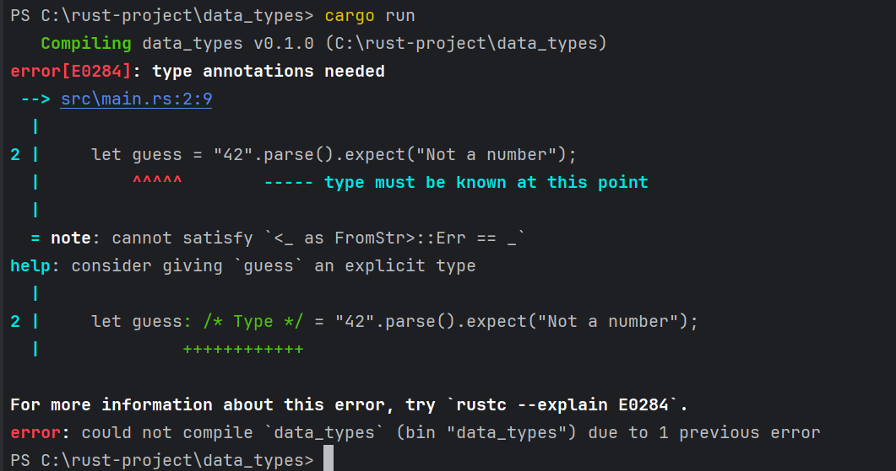

# DataTypes

Rust'taki her değer belirli bir veri türündedir, bu da Rust'a ne tür bir veri belirtildiğini söyler, böylece bu
verilerle nasıl çalışacağını bilir. İki veri türü alt kümesine bakacağız: scalar ve compound.

Rust'ın statik olarak yazılan bir dil olduğunu unutmayın, bu da derleme sırasında tüm değişkenlerin türlerini bilmesi
gerektiği anlamına gelir. Derleyici genellikle değere ve onu nasıl kullandığımıza bağlı olarak hangi türü kullanmak
istediğimizi çıkarabilir. Bölüm 2'deki "Tahmini Gizli Sayı ile Karşılaştırma" bölümünde parse kullanarak bir String'i
sayısal bir türe dönüştürdüğümüzde olduğu gibi birçok türün mümkün olduğu durumlarda, aşağıdaki gibi bir tür ek
anotasyonu eklemeliyiz:

````
fn main() {
    let guess : u32 = "42".parse().expect("Not a number");
    println!("Guess : {guess}");
}
````

Önceki kodda gösterilen : u32 tip ek anotasyonunu eklemezsek, Rust aşağıdaki hatayı görüntüler, bu da derleyicinin hangi
tipi kullanmak istediğimizi bilmek için bizden daha fazla bilgiye ihtiyaç duyduğu anlamına gelir:



## Scalar Types

Bir scalar tip tek bir değeri temsil eder. Rust'ın dört temel scalar türü vardır: integers, floating-point numbers,
Boolean'lar ve characters. Bunları diğer programlama dillerinden tanıyor olabilirsiniz. Rust'ta nasıl çalıştıklarına
geçelim.

### Integer Types

Tamsayı, kesirli bileşeni olmayan bir sayıdır. Bölüm 2'de bir tamsayı türü olan u32 türünü kullandık. Bu tip bildirimi,
ilişkilendirildiği değerin 32 bit yer kaplayan işaretsiz bir tamsayı (işaretli tamsayı tipleri u yerine i ile başlar)
olması gerektiğini belirtir. Tablo 3-1, Rust'taki yerleşik tamsayı türlerini gösterir. Bir tamsayı değerinin türünü
bildirmek için bu varyantlardan herhangi birini kullanabiliriz.


Her değişken işaretli ya da işaretsiz olabilir ve açık bir boyuta sahiptir. İşaretli ve işaretsiz, sayının negatif
olmasının mümkün olup olmadığını, başka bir deyişle, sayının yanında bir işaret olması gerekip gerekmediğini (işaretli)
veya yalnızca pozitif olup olmayacağını ve bu nedenle işaret olmadan gösterilip gösterilemeyeceğini (işaretsiz)
Expression
eder. Bu, sayıları kağıda yazmaya benzer: işaret önemli olduğunda, bir sayı artı işareti veya eksi işareti ile
gösterilir; ancak, sayının pozitif olduğunu varsaymak güvenli olduğunda, işaret olmadan gösterilir. İşaretli sayılar
ikiye tümleyen gösterimi kullanılarak saklanır.

Her işaretli değişken -(2n - 1) ile 2n - 1 - 1 arasındaki sayıları saklayabilir; burada n, değişkenin kullandığı bit
sayısıdır. Yani bir i8 -(27) ila 27 - 1 arasındaki sayıları saklayabilir, bu da -128 ila 127'ye eşittir. İşaretsiz
değişkenler 0 ila 2n - 1 arasındaki sayıları saklayabilir, bu nedenle bir u8 0 ila 28 - 1 arasındaki sayıları
saklayabilir, bu da 0 ila 255'e eşittir.

Ek olarak, isize ve usize türleri programınızın üzerinde çalıştığı bilgisayarın mimarisine bağlıdır, bu da tabloda "
arch" olarak gösterilir: 64 bitlik bir mimarideyseniz 64 bit, 32 bitlik bir mimarideyseniz 32 bit.

Tamsayı değişmezlerini Tablo 3-2'de gösterilen formlardan herhangi birinde yazabilirsiniz. Birden fazla sayısal tür
olabilen sayı değişmezlerinin, türü belirtmek için 57u8 gibi bir tür sonekine izin verdiğini unutmayın. Sayı
değişmezleri ayrıca sayının okunmasını kolaylaştırmak için görsel bir ayırıcı olarak _ kullanabilir, örneğin 1_000, 1000
belirtmişsiniz gibi aynı değere sahip olacaktır.


Peki hangi tamsayı türünü kullanacağınızı nasıl bileceksiniz? Emin değilseniz, Rust'ın varsayılanları genellikle
başlamak için iyi yerlerdir: tamsayı türleri varsayılan olarak i32'dir. isize veya usize'ı kullanacağınız birincil
durum, bir tür koleksiyonu indekslemektir.

Diyelim ki 0 ile 255 arasında değerler tutabilen u8 türünde bir değişkeniniz var. Değişkeni 256 gibi bu aralığın dışında
bir değere değiştirmeye çalışırsanız, tamsayı taşması meydana gelir ve bu da iki davranıştan birine neden olabilir. Hata
ayıklama modunda derleme yaparken, Rust, bu davranış meydana gelirse programınızın çalışma zamanında paniklemesine neden
olan tamsayı taşması kontrolleri içerir. Rust, bir program bir hata ile çıktığında panikleme terimini kullanır;
panikleri Bölüm 9'daki "Panik ile Kurtarılamayan Hatalar!" bölümünde daha ayrıntılı olarak tartışacağız.

Release modunda --release bayrağı ile derleme yaptığınızda, Rust paniğe neden olan tamsayı taşması kontrollerini
içermez. Bunun yerine, taşma meydana gelirse, Rust ikiye tümleyen kaydırma gerçekleştirir. Kısacası, türün tutabileceği
maksimum değerden daha büyük değerler, türün tutabileceği minimum değerlere "sarılır". Bir u8 durumunda, 256 değeri 0
olur, 257 değeri 1 olur ve bu böyle devam eder. Program panik yapmaz, ancak değişken muhtemelen sahip olmasını
beklediğinizden farklı bir değere sahip olacaktır. Tamsayı taşmasının sarma davranışına güvenmek bir hata olarak kabul
edilir.

Taşma olasılığını açıkça ele almak için, ilkel sayısal türler için standart kütüphane tarafından sağlanan bu yöntem
ailelerini kullanabilirsiniz:

* wrap_add gibi wrapping_* yöntemleriyle tüm modlarda sarın.

* checked_* yöntemlerinde taşma varsa None değerini döndürür.

* Değeri ve overflowing_* yöntemleriyle taşma olup olmadığını gösteren bir boolean döndürür.

* saturating_* methodlarıyla değerin minimum veya maksimum değerlerinde doygunluk sağlayın.

### Floating Point Types

Rust ayrıca ondalık noktalı sayılar olan kayan noktalı sayılar için iki ilkel tipe sahiptir. Rust'ın kayan nokta türleri
sırasıyla 32 bit ve 64 bit boyutunda olan f32 ve f64'tür. Varsayılan tür f64'tür çünkü modern CPU'larda f32 ile aşağı
yukarı aynı hızdadır ancak daha fazla hassasiyete sahiptir. Tüm kayan nokta tipleri işaretlidir.

````
fn main() {
    let pi64 = 3.14;

    let pi32 : f32 = 3.147;

    println!("Pi 64 bit : {pi64}");
    println!("Pi 32 bit : {pi32}");
}
````

Kayan noktalı sayılar IEEE-754 standardına göre temsil edilir. f32 tipi tek hassasiyetli bir float'tır ve f64 çift
hassasiyete sahiptir.

### Numeric Operations

Rust, tüm sayı türleri için beklediğiniz temel matematiksel işlemleri destekler: toplama, çıkarma, çarpma, bölme ve
kalan. Tamsayı bölme işlemi sıfıra doğru en yakın tamsayıya kadar keser. Aşağıdaki kod, her bir sayısal işlemi bir let
Statementinde nasıl kullanacağınızı gösterir:

````
fn main() {
    let sum = 5 + 10;

    let difference = 31.4 - 21.6;

    let multiplication = 11 * 12;

    let division = 56.7 / 21.3;

    let remainder = 43 % 5;
}
````

### Boolean Type

Diğer programlama dillerinin çoğunda olduğu gibi, Rust'ta da Boolean türünün iki olası değeri vardır: true ve false.
Boolean'lar bir bayt boyutundadır. Rust'ta Boolean türü bool kullanılarak belirtilir. Örneğin:

````
fn main() {
    let t = true;
    let f : bool = false; // anotasyon aciklamasi ile bool oldugu belirtiliyor
}
````

### The Character Type

Rust'ın char türü, dilin en ilkel alfabetik türüdür. İşte char değerlerini bildirmek için bazı örnekler:

````
fn main() {
    let c = 'z';
    let z : char = 'Z'; //char anotasyonu ile kullanim ornegi
}
````

Karakter değişmezlerini, çift tırnak kullanan String değişmezlerinin aksine tek tırnakla belirttiğimize dikkat edin.
Rust'ın char türü dört bayt boyutundadır ve bir Unicode Scalar Değerini temsil eder, yani ASCII'den çok daha fazlasını
temsil edebilir. Aksanlı harfler; Çince, Japonca ve Korece karakterler; emoji; ve sıfır genişlikli boşlukların tümü
Rust'ta geçerli char değerleridir. Unicode Scalar Değerleri U+0000 ile U+D7FF ve U+E000 ile U+10FFFF arasında değişir.
Bununla birlikte, "karakter" Unicode'da gerçek bir kavram değildir, bu nedenle "karakter "in ne olduğuna dair insan
sezgileriniz Rust'ta karakterin ne olduğuyla eşleşmeyebilir. Bu konuyu Bölüm 8'deki "UTF-8 Kodlu Metni Dizelerle
Saklama" kısmında ayrıntılı olarak tartışacağız.

## Compound Types

Compound tipler birden fazla değeri tek bir tipte gruplayabilir. Rust'ın iki ilkel bileşik türü vardır: tuples ve
arrays.

### The Tuple Type

Bir tuple, çeşitli türlere sahip bir Array değeri tek bir bileşik türde gruplamanın genel bir yoludur. Tuple'ların sabit
bir uzunluğu vardır: bir kez tanımlandıktan sonra boyutları büyüyemez veya küçülemez.

Parantezler içine virgülle ayrılmış bir değer listesi yazarak bir tuple oluştururuz. Tuple'daki her konumun bir türü
vardır ve tuple'daki farklı değerlerin türlerinin aynı olması gerekmez. Bu örnekte isteğe bağlı tür ek anotasyonları
ekledik:

````
fn main() {
    let tup: (i32, f64, u8) = (500, 3.14, 11);
}
````

Bir tuple tek bir bileşik öğe olarak kabul edildiğinden, tup değişkeni tüm tuple'a bağlanır. Bir tuple'dan tek tek
değerleri almak için, bir tuple değerini aşağıdaki gibi destructure etmek için pattern matching kullanabiliriz:

````
fn main() {
    let tup: (i32, f64, u8) = (500, 3.14, 11);
    let (_x,_y,_z) = tup;
    println!("The value of y : {_y}");
}
````

Bu program önce bir tuple oluşturur ve bunu tup değişkenine bağlar. Daha sonra tup'ı alıp x, y ve z olmak üzere üç ayrı
değişkene dönüştürmek için let ile bir kalıp kullanır. Tek bir tuple'ı üç parçaya böldüğü için buna destructing denir.
Son olarak, program y'nin 3.14 olan değerini yazdırır.

Bir tuple elemanına, erişmek istediğimiz değerin indeksini takip eden bir nokta (.) kullanarak da doğrudan erişebiliriz.
Örneğin:

````
fn main() {
    let x: (i32, f64, u8) = (500, 3.14, 10);
    let first_element = x.0; //tuple'in ilk elemani
    let second_element = x.1; //tuple'in ikinci elemani
    let third_element = x.2; //tuple'in ucuncu elemani
}
````

Bu program x tuple'ını oluşturur ve daha sonra tuple'ın her bir elemanına kendi indislerini kullanarak erişir. Çoğu
programlama dilinde olduğu gibi, bir tuple'daki ilk indis 0'dır.

Herhangi bir değeri olmayan tuple'ın özel bir adı vardır, "unit". Bu değer ve karşılık gelen türün her ikisi de ()
şeklinde yazılır ve boş bir değeri veya boş bir dönüş türünü temsil eder. Expression'lar, başka bir değer döndürmezlerse
implicity olarak unit değerini döndürürler.

### The Array Type

Birden fazla değerden oluşan bir koleksiyona sahip olmanın bir başka yolu da Array'dir. Bir tuple'ın aksine, bir
Array'in her elemanı aynı tipe sahip olmalıdır. Diğer bazı dillerdeki Array'lerin aksine, Rust'taki Array'lerin sabit
bir uzunluğu vardır.

Bir Arraydeki değerleri köşeli parantezler içinde virgülle ayrılmış bir liste olarak yazarız:

````
fn main() {
    let a = [1, 2, 3, 4, 5];
}
````

Array'ler, verilerinizin heap yerine stack üzerinde ayrılmasını istediğinizde (stack ve heap'i Bölüm 4'te daha fazla
tartışacağız) veya her zaman sabit sayıda öğeye sahip olduğunuzdan emin olmak istediğinizde kullanışlıdır. Yine de bir
Array, vektör türü kadar esnek değildir. Vektör, standart kütüphane tarafından sağlanan ve boyut olarak büyümesine veya
küçülmesine izin verilen benzer bir koleksiyon türüdür. Array mi yoksa vektör mü kullanmanız gerektiğinden emin
değilseniz, büyük olasılıkla vektör kullanmalısınız. Bölüm 8'de vektörler daha ayrıntılı olarak ele alınmaktadır.

Ancak, eleman sayısının değişmesinin gerekmeyeceğini bildiğiniz durumlarda Array'ler daha kullanışlıdır. Örneğin, bir
programda ay adlarını kullanıyorsanız, her zaman 12 eleman içereceğini bildiğiniz için muhtemelen bir vektör yerine bir
Array kullanırsınız:

Bir Array'in türünü, köşeli parantez içinde her bir elemanın türünü, noktalı virgül ve ardından Array'de ki eleman
sayısını kullanarak yazarsınız:

````
fn main() {
    let a : [i32;5] = [1,2,3,4,5];
}
````

Burada, i32 her bir elemanın türüdür. Noktalı virgülden sonra gelen 5 sayısı Array'in beş eleman içerdiğini gösterir.

Ayrıca, burada gösterildiği gibi, başlangıç değerini, ardından noktalı virgül ve ardından köşeli parantez içinde
Array'in uzunluğunu belirterek bir Array'i her öğe için aynı değeri içerecek şekilde başlatabilirsiniz:

````
fn main() {
    let a = [3; 5];
}
````

a adlı Array 5 eleman içerecek ve bunların hepsi başlangıçta 3 değerine ayarlanacaktır. Bu, let a = [3, 3, 3, 3]
yazmakla
aynıdır; ancak daha kısa bir şekilde.

* Array elemanlarına erişim

Bir Array, yığın üzerinde ayrılabilen, bilinen, sabit boyutta tek bir bellek parçasıdır. Bir Array'in elemanlarına
aşağıdaki gibi indeksleme kullanarak erişebilirsiniz:

````
fn main() {
    let a = [1,2,3,4,5];
    println!("First element of array : {}", a[0]);

    let second_element = a[1];
    print!("Second element of array {second_element}")
}
````

* Geçersiz Array Elemanı Erişimi

Array'in sonunu geçmiş bir Array elemanına erişmeye çalışırsanız ne olacağını görelim. Kullanıcıdan bir String indeksi
almak için Bölüm 2'deki tahmin oyununa benzer şekilde bu kodu çalıştırdığınızı varsayalım:

````
fn main() {
    let _a = [1, 2, 3, 4, 5];

    println!("Please enter an array index");

    let mut index = String::new();

    io::stdin()
        .read_line(&mut index)
        .expect("Failed to read line");

    let index: usize = index.trim().parse().expect("Index entered was not a number");

    let element = _a[index];
    println!("The value of element at index {index} is : {element}");
}
````

Bu kod başarıyla derlenir. Bu kodu cargo run kullanarak çalıştırır ve 0, 1, 2, 3 veya 4 girerseniz, program Arraydeki o
Array'e karşılık gelen değeri yazdıracaktır. Bunun yerine Array'in sonundan sonra 10 gibi bir sayı girerseniz, aşağıdaki
gibi bir çıktı görürsünüz:


Program, indeksleme işleminde geçersiz bir değer kullanılması noktasında bir runtime error ile sonuçlandı.
Program bir hata mesajıyla çıktı ve son println! Statementini çalıştırmadı. İndeksleme kullanarak bir öğeye erişmeye
çalıştığınızda, Rust belirttiğiniz indeksin Array uzunluğundan küçük olup olmadığını kontrol eder. Eğer indeks
uzunluktan büyük veya eşitse, Rust panikleyecektir. Bu kontrol runtime da yapılmalıdır, özellikle bu durumda, çünkü
derleyici kullanıcının kodu daha sonra çalıştırdığında hangi değeri gireceğini bilemez.