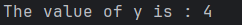

# Functions

Fonksiyonlar Rust kodunda yaygındır. Dildeki en önemli fonksiyonlardan birini zaten gördünüz: birçok programın giriş
noktası olan main fonksiyonu. Ayrıca yeni fonksiyonlar tanımlamanızı sağlayan fn anahtar sözcüğünü de gördünüz.

Rust kodu, tüm harflerin küçük olduğu ve alt çizgilerin kelimeleri ayırdığı function ve variable adları için geleneksel
stil olarak snake case kullanır. İşte örnek bir fonksiyon tanımı içeren bir program:

````
fn main() {
    println!("Hello world");
    another_function();
}

fn another_function(){
    println!("Another function");
}
````

Rust'ta bir fonksiyonu fn yazıp ardından bir fonksiyon adı ve bir dizi parantez girerek tanımlarız. Küme parantezleri
derleyiciye fonksiyon gövdesinin nerede başlayıp nerede biteceğini söyler.

Tanımladığımız herhangi bir fonksiyonu, adını ve ardından bir dizi parantez girerek çağırabiliriz. another_function
program içinde tanımlandığı için, ana fonksiyonun içinden çağrılabilir. Another_function'u kaynak kodda main
fonksiyonundan sonra tanımladığımıza dikkat edin; daha önce de tanımlayabilirdik. Rust, fonksiyonlarınızı nerede
tanımladığınızla ilgilenmez, sadece çağıran tarafından görülebilecek bir kapsamda bir yerde tanımlanmış olmaları
yeterlidir.

Satırlar ana fonksiyonda göründükleri sırayla çalıştırılır. Önce "Hello, world!" mesajı yazdırılır, ardından
another_function çağrılır ve onun mesajı yazdırılır.

### Parameters

Fonksiyonları, fonksiyon imzasının bir parçası olan özel değişkenler olan parametrelere sahip olacak şekilde
tanımlayabiliriz. Bir fonksiyonun parametreleri olduğunda, bu parametreler için somut değerler sağlayabilirsiniz. Teknik
olarak, somut değerlere argüman denir, ancak günlük konuşmalarda insanlar parametre ve argüman kelimelerini ya bir
fonksiyonun tanımındaki değişkenler ya da bir fonksiyonu çağırdığınızda aktarılan somut değerler için birbirinin yerine
kullanma eğilimindedir.

another_function'un bu versiyonunda bir parametre ekliyoruz:

````
fn main() {
    println!("Hello world");
    another_function(5);
}

fn another_function(x : i32){
    println!("The value of parameter : {x}");
}
````

another_function bildiriminde x adında bir parametre vardır. x'in türü i32 olarak belirtilmiştir. 5 değerini
another_function öğesine aktardığımızda, println! makrosu 5 değerini x içeren küme parantezi çiftinin biçim dizesinde
bulunduğu yere yerleştirir.

Fonksiyon imzalarında, her parametrenin türünü bildirmeniz gerekir. Bu, Rust'ın tasarımında bilinçli bir karardır: işlev
tanımlarında tür ek açıklamaları gerektirmek, derleyicinin hangi türü kastettiğinizi anlamak için kodun başka bir
yerinde bunları kullanmanıza neredeyse hiç ihtiyaç duymaması anlamına gelir. Derleyici ayrıca fonksiyonun hangi tipleri
beklediğini bilirse daha yararlı hata mesajları verebilir.

Birden fazla parametre tanımlarken, parametre bildirimlerini aşağıdaki gibi virgülle ayırın:

````
fn main() {
    println!("Hello world");
    another_function(5,'g');
}

fn another_function(x : i32, unit_label : char){
    println!("The value of parameter : {x} and unit lable : {unit_label}");
}
````

İlk parametre x olarak adlandırılır ve bir i32'dir. İkincisi unit_label olarak adlandırılır ve char türündedir.
Fonksiyon daha sonra hem değeri hem de unit_label'ı içeren metni yazdırır.

### Statements and Expressions

Fonksiyon gövdeleri, isteğe bağlı olarak bir expression ile biten bir dizi Statement'dan oluşur. Şimdiye kadar ele
aldığımız fonksiyonlar bir son expression içermiyordu, ancak bir statement'in parçası olarak bir expression gördünüz.
Rust expression-based language olduğu için, bu anlaşılması gereken önemli bir ayrımdır. Diğer dillerde aynı ayrımlar
yoktur, bu nedenle statement'ların ve expression'ların ne olduğuna ve farklılıklarının fonksiyonların gövdelerini nasıl
etkilediğine bakalım.

* Statement'lar, bazı action'ları gerçekleştiren ve bir değer döndürmeyen talimatlardır.

* Expression'lar bir sonuç değerine göre değerlendirilir. Bazı örneklere bakalım

Aslında zaten statement'ları ve expression'ları kullandık. let anahtar sözcüğü ile bir değişken oluşturmak ve ona bir
değer atamak
bir statement'dir. Liste 3-1'de let y = 6; bir statement'dir.

````
fn main() {
    let y = 6;
}
````

Fonksiyon tanımları da statement'dir; önceki örneğin tamamı kendi içinde bir statement'dir.

Statement'lar değer döndürmez. Bu nedenle, aşağıdaki kodun yapmaya çalıştığı gibi bir let Statement'ini başka bir
değişkene atayamazsınız; hata alırsınız:

````
fn main() {
    let x = (let y = 6);
}
````

let y = 6 Statement'i bir değer döndürmez, bu nedenle x'in bind olacağı bir şey yoktur. Bu, atamanın atamanın değerini
döndürdüğü C ve Ruby gibi diğer dillerde olanlardan farklıdır. Bu dillerde, x = y = 6 yazabilir ve hem x hem de y'nin 6
değerine sahip olmasını sağlayabilirsiniz; Rust'ta durum böyle değildir.

Expression'lar bir değere göre değerlendirilir ve Rust'ta yazacağınız kodun geri kalanının çoğunu oluşturur. Örneğin 5 +
6 gibi bir matematik işlemini düşünün; bu, 11 değerine göre değerlendirilen bir Expression'dir. Expression'lar,
Statement'ların bir parçası olabilir:

let y = 6; Statement'inda ki 6, 6 değerine göre değerlendirilen bir Expression'dır

Bir fonksiyonun çağrılması bir Expression'dır. Makro çağırmak bir Expression'dır. Örneğin, küme parantezleriyle
oluşturulan yeni bir kapsam bloğu bir Expression'dir:

````
fn main() {
    let y = {
        let x = 3;
        x + 1
    };

    print!("The value of y is : {y}");
}
````

Çıktı olarak :



Burada ki expression:

````
{
    let x = 3;
    x + 1
}
````

bu durumda 4 olarak değerlendirilen bir bloktur. let statement'inin bir parçası olarak bu değer y'ye bağlanır. x + 1
satırının sonunda noktalı virgül olmadığına dikkat edin; bu, şu ana kadar gördüğünüz satırların çoğundan farklıdır.
Expression'lar sondaki noktalı virgülleri içermez. Bir expression'ın sonuna noktalı virgül eklerseniz, Expression'i bir
Statement'a dönüştürürsünüz ve bu durumda bir değer döndürmez. Bundan sonra fonksiyon dönüş değerlerini ve
Expression'lari keşfederken bunu aklınızda tutun.

### Dönüş Değerleri Olan Fonksiyonlar

Fonksiyonlar kendilerini çağıran koda değer döndürebilirler. Geri dönüş değerlerine isim vermeyiz, ancak türlerini bir
oktan (->) sonra bildirmeliyiz. Rust'ta, fonksiyonun geri dönüş değeri, fonksiyon gövdesinin bloğundaki son
Expression'ın değeri ile eş anlamlıdır. return anahtar sözcüğünü kullanarak ve bir değer belirterek bir fonksiyondan
erken dönebilirsiniz, ancak çoğu fonksiyon son expresion'i implicity olarak döndürür. İşte değer döndüren bir fonksiyon
örneği:

````
fn main() {
    let x = five();
    println!("The value of x : {x}");
}

fn five() -> i32 {
    5
}
````

five fonksiyonunda fonksiyon çağrıları, makrolar ve hatta let deyimleri yoktur; sadece 5 sayısı tek başına yer alır.
Bu Rust'ta tamamen geçerli bir fonksiyondur. Fonksiyonun dönüş tipinin de -> i32 olarak belirtildiğine dikkat edin. Bu
kodu çalıştırmayı deneyin;

five() 5, fonksiyonun geri dönüş değeridir, bu yüzden geri dönüş tipi i32'dir. Bunu daha ayrıntılı olarak inceleyelim.
İki önemli nokta var: Birincisi, let x = five(); satırı, bir değişkeni başlatmak için bir fonksiyonun geri dönüş
değerini kullandığımızı gösterir. five() fonksiyonu 5 döndürdüğü için, bu satır aşağıdakiyle aynıdır:

````
let x = 5;
````

İkinci olarak, five fonksiyonunun parametresi yoktur ve dönüş değerinin türünü tanımlar, ancak fonksiyonun gövdesi
noktalı virgül olmadan yalnız bir 5'tir, çünkü değeri döndürmek istediğimiz bir expression'dır.

Başka bir örneğe bakalım:

````
fn main() {
    let x = plus_one(5);
    println!("The value of x : {x}");
}

fn plus_one(x : i32) -> i32 {
    x + 1
}
````

Bu kod çalıştırıldığında x'in değeri şu şekilde yazdırılacaktır: 6. Ancak x + 1 Expression'ini içeren satırın sonuna
noktalı virgül koyarak expression'dan statement'a dönüştürürsek bir hata alırız: