Rust, varsayılan olarak standart kütüphanede tanımlanan ve her programın kapsamına giren bir Array öğeye sahiptir. Bu
kümeye "prelude" denir ve içindeki her şeyi standart kütüphane belgelerinde görebilirsiniz.

https://doc.rust-lang.org/std/prelude/index.html

Random kütüphanesi rust'ın standart kütüphanesinde olmadığı için Cargo.toml dosyası içerisine ilgili dependency'leri
eklememiz gerekiyor

cargo.toml içerisine Random dependencies'lerini ekledikten sonra cargo build komutu ile projeyi build etmeliyiz

Harici bir bağımlılık eklediğimizde, Cargo bu bağımlılığın ihtiyaç duyduğu her şeyin en son sürümlerini Crates.io'daki
verilerin bir kopyası olan kayıt defterinden alır. Crates.io, Rust ekosistemindeki insanların açık kaynaklı Rust
projelerini başkalarının kullanması için yayınladıkları yerdir.

Kayıt defterini güncelledikten sonra, Cargo [Dependencies] bölümünü kontrol eder ve daha önce indirilmemiş olan tüm
crate'leri indirir. Bu durumda, sadece rand'ı bağımlılık olarak listelemiş olsak da, Cargo rand'ın çalışmak için bağımlı
olduğu diğer crate'leri de yakaladı. Crate'leri indirdikten sonra, Rust bunları derler ve ardından projeyi mevcut
bağımlılıklarla derler.

Cargo, siz veya bir başkası kodunuzu her derlediğinde aynı eseri yeniden oluşturabilmenizi sağlayan bir mekanizmaya
sahiptir: Cargo, siz aksini belirtmedikçe yalnızca belirttiğiniz bağımlılıkların sürümlerini kullanacaktır. Örneğin,
gelecek hafta rand crate'inin 0.8.6 sürümünün çıktığını ve bu sürümün önemli bir hata düzeltmesi içerdiğini, ancak aynı
zamanda kodunuzu bozacak bir regresyon içerdiğini varsayalım. Bunu ele almak için Rust, cargo derlemesini ilk kez
çalıştırdığınızda Cargo.lock dosyasını oluşturur, bu nedenle şimdi bunu guessing_game Arrayninde bulunduruyoruz.

Bir projeyi ilk kez oluşturduğunuzda, Cargo kriterlere uyan bağımlılıkların tüm sürümlerini belirler ve ardından bunları
Cargo.lock dosyasına yazar. Gelecekte projenizi derlediğinizde, Cargo Cargo.lock dosyasının var olduğunu görecek ve
sürümleri tekrar bulmak için tüm işi yapmak yerine orada belirtilen sürümleri kullanacaktır. Bu, otomatik olarak yeniden
üretilebilir bir yapıya sahip olmanızı sağlar. Başka bir deyişle, Cargo.lock dosyası sayesinde siz açıkça yükseltme
yapana kadar projeniz 0.8.5 sürümünde kalacaktır. Cargo.lock dosyası tekrarlanabilir derlemeler için önemli olduğundan,
genellikle projenizdeki kodun geri kalanıyla birlikte kaynak kontrolünde kontrol edilir.

Bir crate'i güncellemek istediğinizde, Cargo, Cargo.lock dosyasını yok sayacak ve Cargo.toml'daki spesifikasyonlarınıza
uyan en son sürümleri bulacak olan update komutunu sağlar. Cargo daha sonra bu sürümleri Cargo.lock dosyasına
yazacaktır. Aksi takdirde, varsayılan olarak, Cargo yalnızca 0.8.5'ten büyük ve 0.9.0'dan küçük sürümleri arayacaktır.
Eğer rand crate iki yeni 0.8.6 ve 0.9.0 sürümlerini yayınladıysa, cargo update'i çalıştırdığınızda aşağıdakileri
görürsünüz:


Cargo 0.9.0 sürümünü yok sayar. Bu noktada, Cargo.lock dosyanızda şu anda kullandığınız rand crate sürümünün 0.8.5
olduğunu belirten bir değişiklik de fark edeceksiniz. Rand'ın 0.9.0 sürümünü ya da 0.9.x serisindeki herhangi bir sürümü
kullanmak için Cargo.toml dosyasını aşağıdaki gibi güncellemeniz gerekir:


Cargo build'i bir sonraki çalıştırışınızda, Cargo mevcut crate'lerinin kayıt defterini güncelleyecek ve rand
gereksinimlerinizi belirttiğiniz yeni sürüme göre yeniden değerlendirecektir.

Bir crate'de hangi özelliklerin kullanılacağını ve hangi method ve işlevlerin çağrılacağını bilmeniz yeterli
olmayacaktır, bu nedenle her crate, kullanım talimatlarını içeren belgelere sahiptir. Cargo'nun bir başka güzel
özelliği de cargo doc --open komutunu çalıştırdığınızda tüm bağımlılıklarınız tarafından sağlanan belgeleri yerel olarak
oluşturması ve tarayıcınızda açmasıdır. Örneğin rand crate'indeki diğer işlevlerle ilgileniyorsanız, cargo doc --open
komutunu çalıştırın ve soldaki kenar çubuğunda rand'a tıklayın.

# Variables

Değerleri Variable'larda Saklama" bölümünde belirtildiği gibi, varsayılan olarak variable'lar immutable'dır. Bu,
kodunuzu
Rust'ın sunduğu güvenlik ve kolay eşzamanlılıktan yararlanacak şekilde yazmanız için Rust'ın size verdiği birçok
dürtüden biridir. Ancak yine de değişkenlerinizi değiştirilebilir yapma seçeneğiniz vardır. Rust'ın sizi Immutableliği
tercih etmeye nasıl ve neden teşvik ettiğini ve bazen neden vazgeçmek isteyebileceğinizi inceleyelim.

````
fn main() {
    let x = 10;
    println!("The value of x : {x}");

    x = 11;
    println!("The value of x : {x}");
}
````

Bir değişken immutable olduğunda, bir değer bir isme bağlandığında, bu değeri değiştiremezsiniz. Yukarıda ki kod x'e
ikinci atamada hata verecektir

Bu örnek, derleyicinin programlarınızdaki hataları bulmanıza nasıl yardımcı olduğunu göstermektedir. Derleyici hataları
sinir bozucu olabilir, ancak aslında sadece programınızın henüz yapmasını istediğiniz şeyi güvenli bir şekilde yapmadığı
anlamına gelir; iyi bir programcı olmadığınız anlamına gelmez! Deneyimli Rustaceanlar hala derleyici hataları alırlar.

Immutable x değişkenine ikinci bir değer atamaya çalıştığınız için `x` immutable değişkenine iki kez atama yapılamaz
hata mesajını aldınız.

Immutable olarak belirlenmiş bir değeri değiştirmeye çalıştığımızda derleme zamanı hataları almamız önemlidir çünkü bu
durum hatalara yol açabilir. Kodumuzun bir bölümü bir değerin asla değişmeyeceği varsayımıyla çalışıyorsa ve kodumuzun
başka bir bölümü bu değeri değiştirirse, kodun ilk bölümünün yapmak için tasarlandığı şeyi yapmaması mümkündür. Bu tür
bir hatanın nedenini sonradan bulmak zor olabilir, özellikle de ikinci kod parçası değeri yalnızca bazen değiştiriyorsa.
Rust derleyicisi, bir değerin değişmeyeceğini belirttiğinizde, gerçekten değişmeyeceğini garanti eder, böylece bunu
kendiniz takip etmek zorunda kalmazsınız. Böylece kodunuzun mantık yürütmesi daha kolay olur.

Ancak değişebilirlik çok faydalı olabilir ve kod yazmayı daha kolay hale getirebilir. Değişkenler varsayılan olarak
Immutable olsa da, Bölüm 2'de yaptığınız gibi değişken adının önüne `mut` ekleyerek onları değişebilir hale
getirebilirsiniz. Mut eklemek ayrıca kodun diğer bölümlerinin bu değişkenin değerini değiştireceğini göstererek kodun
gelecekteki okuyucularına niyet iletir.

````
fn main() {
    let mut x = 10;
    println!("The value of x : {x}");

    x = 11;
    println!("The value of x : {x}");
}
````

Mut kullanıldığında x'e bağlı değeri 10'dan 11'e değiştirmemize izin verilir.

### Constants

Immutable değişkenler gibi, constant'lar da bir isme bağlı olan ve değişmesine izin verilmeyen değerlerdir, ancak
constantlar ve değişkenler arasında birkaç fark vardır.

İlk olarak, constantlar ile mut kullanmanıza izin verilmez. Constantlar yalnızca varsayılan olarak Immutable değildir,
her zaman Immutabledir. Constantları let anahtar sözcüğü yerine const anahtar sözcüğünü kullanarak bildirirsiniz ve
değerin türü ek açıklamalı olmalıdır. Türleri ve tür ek açıklamalarını bir sonraki bölüm olan "Veri Türleri" bölümünde
ele alacağız, bu nedenle şu anda ayrıntılar hakkında endişelenmeyin. Sadece her zaman türe açıklama eklemeniz
gerektiğini bilin.

Constant'lar, global kapsam da dahil olmak üzere herhangi bir kapsamda bildirilebilir, bu da onları kodun birçok
bölümünün bilmesi gereken değerler için kullanışlı kılar.

Son fark, constant'ların yalnızca runtime'da hesaplanabilecek bir değerin sonucuna değil, yalnızca sabit bir
Expressionye
ayarlanabilmesidir.

````
fn main() {
    const THREE_HOUR_IN_SECONDS : u32 = 60 * 60 * 3;
    println!("Three hours in seconds : {THREE_HOUR_IN_SECONDS}");
}
````

Constant'ın adı THREE_HOURS_IN_SECONDS'dur ve değeri 60 (bir dakikadaki saniye sayısı) ile 60'ın (bir saatteki dakika
sayısı) 3 (bu programda saymak istediğimiz saat sayısı) ile çarpımının sonucuna ayarlanır. Rust'ın constant'lar için
adlandırma kuralı, sözcükler arasında alt çizgi ile tüm büyük harfleri kullanmaktır. Derleyici, derleme zamanında
sınırlı bir Array işlemi değerlendirebilir, bu da bu sabiti 10.800 değerine ayarlamak yerine bu değeri anlaşılması ve
doğrulanması daha kolay bir şekilde yazmayı seçmemizi sağlar.

Constant'lar, bildirildikleri kapsam dahilinde bir programın çalıştığı süre boyunca geçerlidir. Bu özellik, uygulama
alanınızda programın birden fazla bölümünün bilmesi gerekebilecek değerler için Constant'lari kullanışlı hale getirir;
örneğin bir oyundaki herhangi bir oyuncunun kazanmasına izin verilen maksimum puan sayısı veya ışık hızı gibi.

### Shadowing

Bölüm 2'deki guessing game eğitiminde gördüğünüz gibi, önceki bir değişkenle aynı ada sahip yeni bir değişken
bildirebilirsiniz. Rustaceanlar ilk değişkenin ikincisi tarafından gölgelendiğini söyler, bu da değişkenin adını
kullandığınızda derleyicinin göreceği şeyin ikinci değişken olduğu anlamına gelir. Gerçekte, ikinci değişken birinciyi
gölgeler ve kendisi gölgelenene ya da kapsam sona erene kadar değişken adının tüm kullanımlarını kendine alır. Aynı
değişkenin adını kullanarak ve let anahtar sözcüğünün kullanımını aşağıdaki gibi tekrarlayarak bir değişkeni
gölgeleyebiliriz:

````
fn main() {
    let x = 5;
    let x = x + 1;

    {
        /* x scope disinda 6 degerine shadowing edildi */
        let x = x * 2;
        println!("The value of x in the inner scope is : {x}"); // 12 sonucu return edilir
    }

    println!("The value of x is : {x}"); // 6 sonucu return edilir
}
````

Bu program ilk olarak x'i 5 değerine bağlar. Daha sonra let x = Expressionsini tekrarlayarak yeni bir x değişkeni
oluşturur,
orijinal değeri alır ve 1 ekler, böylece x'in değeri 6 olur. Ardından, küme parantezleriyle oluşturulan bir iç kapsam
içinde, üçüncü let Statementi de x'i gölgeler ve x'e 12 değerini vermek için önceki değeri 2 ile çarparak yeni bir
değişken
oluşturur. Bu kapsam sona erdiğinde, iç gölgeleme sona erer ve x 6 değerine geri döner. Bu programı çalıştırdığımızda,
aşağıdaki çıktıyı verecektir:


Gölgeleme, bir değişkeni mut olarak işaretlemekten farklıdır çünkü let anahtar sözcüğünü kullanmadan yanlışlıkla bu
değişkene yeniden atama yapmaya çalışırsak derleme zamanı hatası alırız. let kullanarak, bir değer üzerinde birkaç
dönüşüm gerçekleştirebilir, ancak bu dönüşümler tamamlandıktan sonra değişkenin immutable olmasını sağlayabiliriz.

Mut ve gölgeleme arasındaki diğer fark, let anahtar sözcüğünü tekrar kullandığımızda etkin bir şekilde yeni bir değişken
oluşturduğumuz için, değerin türünü değiştirebilir ancak aynı adı yeniden kullanabiliriz. Örneğin, programımızın bir
kullanıcıdan boşluk karakterleri girerek bazı metinler arasında kaç boşluk istediğini göstermesini istediğini ve
ardından bu girdiyi bir sayı olarak saklamak istediğimizi varsayalım:

````
fn main() {
    let spaces = "     ";
    let spaces = spaces.len();
    println!("Spaces length : {spaces}");
}
````

İlk spaces değişkeni bir string tipidir ve ikinci spaces değişkeni bir sayı tipidir. Böylece gölgeleme bizi spaces_str
ve spaces_num gibi farklı isimler bulmaktan kurtarır; bunun yerine daha basit olan spaces ismini tekrar kullanabiliriz.
Ancak, burada gösterildiği gibi bunun için mut kullanmaya çalışırsak, derleme zamanı hatası alırız:

````
fn main() {
    let mut spaces = "     ";
    spaces = spaces.len();
    println!("Spaces length : {spaces}");
}
````


Hata, bir değişkenin türünü değiştirmemize izin verilmediğini söylüyor:

# DataTypes

Rust'taki her değer belirli bir veri türündedir, bu da Rust'a ne tür bir veri belirtildiğini söyler, böylece bu
verilerle nasıl çalışacağını bilir. İki veri türü alt kümesine bakacağız: scalar ve compound.

Rust'ın statik olarak yazılan bir dil olduğunu unutmayın, bu da derleme sırasında tüm değişkenlerin türlerini bilmesi
gerektiği anlamına gelir. Derleyici genellikle değere ve onu nasıl kullandığımıza bağlı olarak hangi türü kullanmak
istediğimizi çıkarabilir. Bölüm 2'deki "Tahmini Gizli Sayı ile Karşılaştırma" bölümünde parse kullanarak bir String'i
sayısal bir türe dönüştürdüğümüzde olduğu gibi birçok türün mümkün olduğu durumlarda, aşağıdaki gibi bir tür ek
anotasyonu eklemeliyiz:

````
fn main() {
    let guess : u32 = "42".parse().expect("Not a number");
    println!("Guess : {guess}");
}
````

Önceki kodda gösterilen : u32 tip ek anotasyonunu eklemezsek, Rust aşağıdaki hatayı görüntüler, bu da derleyicinin hangi
tipi kullanmak istediğimizi bilmek için bizden daha fazla bilgiye ihtiyaç duyduğu anlamına gelir:

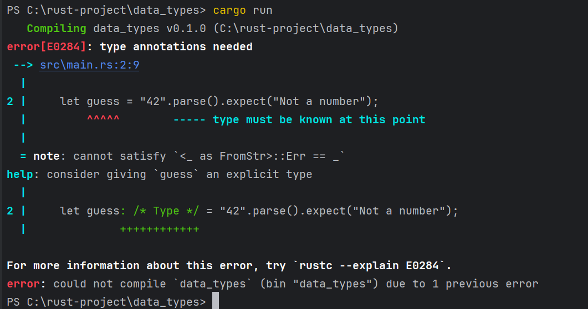

## Scalar Types

Bir scalar tip tek bir değeri temsil eder. Rust'ın dört temel scalar türü vardır: integers, floating-point numbers,
Boolean'lar ve characters. Bunları diğer programlama dillerinden tanıyor olabilirsiniz. Rust'ta nasıl çalıştıklarına
geçelim.

### Integer Types

Tamsayı, kesirli bileşeni olmayan bir sayıdır. Bölüm 2'de bir tamsayı türü olan u32 türünü kullandık. Bu tip bildirimi,
ilişkilendirildiği değerin 32 bit yer kaplayan işaretsiz bir tamsayı (işaretli tamsayı tipleri u yerine i ile başlar)
olması gerektiğini belirtir. Tablo 3-1, Rust'taki yerleşik tamsayı türlerini gösterir. Bir tamsayı değerinin türünü
bildirmek için bu varyantlardan herhangi birini kullanabiliriz.

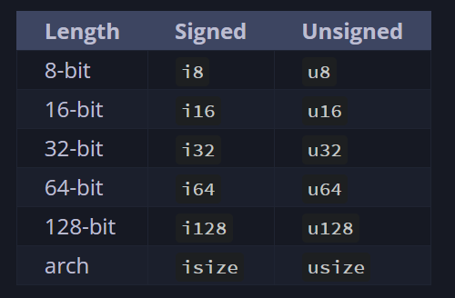

Her değişken işaretli ya da işaretsiz olabilir ve açık bir boyuta sahiptir. İşaretli ve işaretsiz, sayının negatif
olmasının mümkün olup olmadığını, başka bir deyişle, sayının yanında bir işaret olması gerekip gerekmediğini (işaretli)
veya yalnızca pozitif olup olmayacağını ve bu nedenle işaret olmadan gösterilip gösterilemeyeceğini (işaretsiz)
Expression
eder. Bu, sayıları kağıda yazmaya benzer: işaret önemli olduğunda, bir sayı artı işareti veya eksi işareti ile
gösterilir; ancak, sayının pozitif olduğunu varsaymak güvenli olduğunda, işaret olmadan gösterilir. İşaretli sayılar
ikiye tümleyen gösterimi kullanılarak saklanır.

Her işaretli değişken -(2n - 1) ile 2n - 1 - 1 arasındaki sayıları saklayabilir; burada n, değişkenin kullandığı bit
sayısıdır. Yani bir i8 -(27) ila 27 - 1 arasındaki sayıları saklayabilir, bu da -128 ila 127'ye eşittir. İşaretsiz
değişkenler 0 ila 2n - 1 arasındaki sayıları saklayabilir, bu nedenle bir u8 0 ila 28 - 1 arasındaki sayıları
saklayabilir, bu da 0 ila 255'e eşittir.

Ek olarak, isize ve usize türleri programınızın üzerinde çalıştığı bilgisayarın mimarisine bağlıdır, bu da tabloda "
arch" olarak gösterilir: 64 bitlik bir mimarideyseniz 64 bit, 32 bitlik bir mimarideyseniz 32 bit.

Tamsayı değişmezlerini Tablo 3-2'de gösterilen formlardan herhangi birinde yazabilirsiniz. Birden fazla sayısal tür
olabilen sayı değişmezlerinin, türü belirtmek için 57u8 gibi bir tür sonekine izin verdiğini unutmayın. Sayı
değişmezleri ayrıca sayının okunmasını kolaylaştırmak için görsel bir ayırıcı olarak _ kullanabilir, örneğin 1_000, 1000
belirtmişsiniz gibi aynı değere sahip olacaktır.

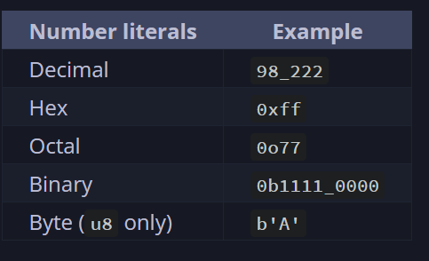

Peki hangi tamsayı türünü kullanacağınızı nasıl bileceksiniz? Emin değilseniz, Rust'ın varsayılanları genellikle
başlamak için iyi yerlerdir: tamsayı türleri varsayılan olarak i32'dir. isize veya usize'ı kullanacağınız birincil
durum, bir tür koleksiyonu indekslemektir.

Diyelim ki 0 ile 255 arasında değerler tutabilen u8 türünde bir değişkeniniz var. Değişkeni 256 gibi bu aralığın dışında
bir değere değiştirmeye çalışırsanız, tamsayı taşması meydana gelir ve bu da iki davranıştan birine neden olabilir. Hata
ayıklama modunda derleme yaparken, Rust, bu davranış meydana gelirse programınızın çalışma zamanında paniklemesine neden
olan tamsayı taşması kontrolleri içerir. Rust, bir program bir hata ile çıktığında panikleme terimini kullanır;
panikleri Bölüm 9'daki "Panik ile Kurtarılamayan Hatalar!" bölümünde daha ayrıntılı olarak tartışacağız.

Release modunda --release bayrağı ile derleme yaptığınızda, Rust paniğe neden olan tamsayı taşması kontrollerini
içermez. Bunun yerine, taşma meydana gelirse, Rust ikiye tümleyen kaydırma gerçekleştirir. Kısacası, türün tutabileceği
maksimum değerden daha büyük değerler, türün tutabileceği minimum değerlere "sarılır". Bir u8 durumunda, 256 değeri 0
olur, 257 değeri 1 olur ve bu böyle devam eder. Program panik yapmaz, ancak değişken muhtemelen sahip olmasını
beklediğinizden farklı bir değere sahip olacaktır. Tamsayı taşmasının sarma davranışına güvenmek bir hata olarak kabul
edilir.

Taşma olasılığını açıkça ele almak için, ilkel sayısal türler için standart kütüphane tarafından sağlanan bu yöntem
ailelerini kullanabilirsiniz:

* wrap_add gibi wrapping_* yöntemleriyle tüm modlarda sarın.

* checked_* yöntemlerinde taşma varsa None değerini döndürür.

* Değeri ve overflowing_* yöntemleriyle taşma olup olmadığını gösteren bir boolean döndürür.

* saturating_* methodlarıyla değerin minimum veya maksimum değerlerinde doygunluk sağlayın.

### Floating Point Types

Rust ayrıca ondalık noktalı sayılar olan kayan noktalı sayılar için iki ilkel tipe sahiptir. Rust'ın kayan nokta türleri
sırasıyla 32 bit ve 64 bit boyutunda olan f32 ve f64'tür. Varsayılan tür f64'tür çünkü modern CPU'larda f32 ile aşağı
yukarı aynı hızdadır ancak daha fazla hassasiyete sahiptir. Tüm kayan nokta tipleri işaretlidir.

````
fn main() {
    let pi64 = 3.14;

    let pi32 : f32 = 3.147;

    println!("Pi 64 bit : {pi64}");
    println!("Pi 32 bit : {pi32}");
}
````

Kayan noktalı sayılar IEEE-754 standardına göre temsil edilir. f32 tipi tek hassasiyetli bir float'tır ve f64 çift
hassasiyete sahiptir.

### Numeric Operations

Rust, tüm sayı türleri için beklediğiniz temel matematiksel işlemleri destekler: toplama, çıkarma, çarpma, bölme ve
kalan. Tamsayı bölme işlemi sıfıra doğru en yakın tamsayıya kadar keser. Aşağıdaki kod, her bir sayısal işlemi bir let
Statementinde nasıl kullanacağınızı gösterir:

````
fn main() {
    let sum = 5 + 10;

    let difference = 31.4 - 21.6;

    let multiplication = 11 * 12;

    let division = 56.7 / 21.3;

    let remainder = 43 % 5;
}
````

### Boolean Type

Diğer programlama dillerinin çoğunda olduğu gibi, Rust'ta da Boolean türünün iki olası değeri vardır: true ve false.
Boolean'lar bir bayt boyutundadır. Rust'ta Boolean türü bool kullanılarak belirtilir. Örneğin:

````
fn main() {
    let t = true;
    let f : bool = false; // anotasyon aciklamasi ile bool oldugu belirtiliyor
}
````

### The Character Type

Rust'ın char türü, dilin en ilkel alfabetik türüdür. İşte char değerlerini bildirmek için bazı örnekler:

````
fn main() {
    let c = 'z';
    let z : char = 'Z'; //char anotasyonu ile kullanim ornegi
}
````

Karakter değişmezlerini, çift tırnak kullanan String değişmezlerinin aksine tek tırnakla belirttiğimize dikkat edin.
Rust'ın char türü dört bayt boyutundadır ve bir Unicode Scalar Değerini temsil eder, yani ASCII'den çok daha fazlasını
temsil edebilir. Aksanlı harfler; Çince, Japonca ve Korece karakterler; emoji; ve sıfır genişlikli boşlukların tümü
Rust'ta geçerli char değerleridir. Unicode Scalar Değerleri U+0000 ile U+D7FF ve U+E000 ile U+10FFFF arasında değişir.
Bununla birlikte, "karakter" Unicode'da gerçek bir kavram değildir, bu nedenle "karakter "in ne olduğuna dair insan
sezgileriniz Rust'ta karakterin ne olduğuyla eşleşmeyebilir. Bu konuyu Bölüm 8'deki "UTF-8 Kodlu Metni Dizelerle
Saklama" kısmında ayrıntılı olarak tartışacağız.

## Compound Types

Compound tipler birden fazla değeri tek bir tipte gruplayabilir. Rust'ın iki ilkel bileşik türü vardır: tuples ve
arrays.

### The Tuple Type

Bir tuple, çeşitli türlere sahip bir Array değeri tek bir bileşik türde gruplamanın genel bir yoludur. Tuple'ların sabit
bir uzunluğu vardır: bir kez tanımlandıktan sonra boyutları büyüyemez veya küçülemez.

Parantezler içine virgülle ayrılmış bir değer listesi yazarak bir tuple oluştururuz. Tuple'daki her konumun bir türü
vardır ve tuple'daki farklı değerlerin türlerinin aynı olması gerekmez. Bu örnekte isteğe bağlı tür ek anotasyonları
ekledik:

````
fn main() {
    let tup: (i32, f64, u8) = (500, 3.14, 11);
}
````

Bir tuple tek bir bileşik öğe olarak kabul edildiğinden, tup değişkeni tüm tuple'a bağlanır. Bir tuple'dan tek tek
değerleri almak için, bir tuple değerini aşağıdaki gibi destructure etmek için pattern matching kullanabiliriz:

````
fn main() {
    let tup: (i32, f64, u8) = (500, 3.14, 11);
    let (_x,_y,_z) = tup;
    println!("The value of y : {_y}");
}
````

Bu program önce bir tuple oluşturur ve bunu tup değişkenine bağlar. Daha sonra tup'ı alıp x, y ve z olmak üzere üç ayrı
değişkene dönüştürmek için let ile bir kalıp kullanır. Tek bir tuple'ı üç parçaya böldüğü için buna destructing denir.
Son olarak, program y'nin 3.14 olan değerini yazdırır.

Bir tuple elemanına, erişmek istediğimiz değerin indeksini takip eden bir nokta (.) kullanarak da doğrudan erişebiliriz.
Örneğin:

````
fn main() {
    let x: (i32, f64, u8) = (500, 3.14, 10);
    let first_element = x.0; //tuple'in ilk elemani
    let second_element = x.1; //tuple'in ikinci elemani
    let third_element = x.2; //tuple'in ucuncu elemani
}
````

Bu program x tuple'ını oluşturur ve daha sonra tuple'ın her bir elemanına kendi indislerini kullanarak erişir. Çoğu
programlama dilinde olduğu gibi, bir tuple'daki ilk indis 0'dır.

Herhangi bir değeri olmayan tuple'ın özel bir adı vardır, "unit". Bu değer ve karşılık gelen türün her ikisi de ()
şeklinde yazılır ve boş bir değeri veya boş bir dönüş türünü temsil eder. Expression'lar, başka bir değer döndürmezlerse
implicity olarak unit değerini döndürürler.

### The Array Type

Birden fazla değerden oluşan bir koleksiyona sahip olmanın bir başka yolu da Array'dir. Bir tuple'ın aksine, bir
Array'in her elemanı aynı tipe sahip olmalıdır. Diğer bazı dillerdeki Array'lerin aksine, Rust'taki Array'lerin sabit
bir uzunluğu vardır.

Bir Arraydeki değerleri köşeli parantezler içinde virgülle ayrılmış bir liste olarak yazarız:

````
fn main() {
    let a = [1, 2, 3, 4, 5];
}
````

Array'ler, verilerinizin heap yerine stack üzerinde ayrılmasını istediğinizde (stack ve heap'i Bölüm 4'te daha fazla
tartışacağız) veya her zaman sabit sayıda öğeye sahip olduğunuzdan emin olmak istediğinizde kullanışlıdır. Yine de bir
Array, vektör türü kadar esnek değildir. Vektör, standart kütüphane tarafından sağlanan ve boyut olarak büyümesine veya
küçülmesine izin verilen benzer bir koleksiyon türüdür. Array mi yoksa vektör mü kullanmanız gerektiğinden emin
değilseniz, büyük olasılıkla vektör kullanmalısınız. Bölüm 8'de vektörler daha ayrıntılı olarak ele alınmaktadır.

Ancak, eleman sayısının değişmesinin gerekmeyeceğini bildiğiniz durumlarda Array'ler daha kullanışlıdır. Örneğin, bir
programda ay adlarını kullanıyorsanız, her zaman 12 eleman içereceğini bildiğiniz için muhtemelen bir vektör yerine bir
Array kullanırsınız:

Bir Array'in türünü, köşeli parantez içinde her bir elemanın türünü, noktalı virgül ve ardından Array'de ki eleman
sayısını kullanarak yazarsınız:

````
fn main() {
    let a : [i32;5] = [1,2,3,4,5];
}
````

Burada, i32 her bir elemanın türüdür. Noktalı virgülden sonra gelen 5 sayısı Array'in beş eleman içerdiğini gösterir.

Ayrıca, burada gösterildiği gibi, başlangıç değerini, ardından noktalı virgül ve ardından köşeli parantez içinde
Array'in uzunluğunu belirterek bir Array'i her öğe için aynı değeri içerecek şekilde başlatabilirsiniz:

````
fn main() {
    let a = [3; 5];
}
````

a adlı Array 5 eleman içerecek ve bunların hepsi başlangıçta 3 değerine ayarlanacaktır. Bu, let a = [3, 3, 3, 3]
yazmakla
aynıdır; ancak daha kısa bir şekilde.

* Array elemanlarına erişim

Bir Array, yığın üzerinde ayrılabilen, bilinen, sabit boyutta tek bir bellek parçasıdır. Bir Array'in elemanlarına
aşağıdaki gibi indeksleme kullanarak erişebilirsiniz:

````
fn main() {
    let a = [1,2,3,4,5];
    println!("First element of array : {}", a[0]);

    let second_element = a[1];
    print!("Second element of array {second_element}")
}
````

* Geçersiz Array Elemanı Erişimi

Array'in sonunu geçmiş bir Array elemanına erişmeye çalışırsanız ne olacağını görelim. Kullanıcıdan bir String indeksi
almak için Bölüm 2'deki tahmin oyununa benzer şekilde bu kodu çalıştırdığınızı varsayalım:

````
fn main() {
    let _a = [1, 2, 3, 4, 5];

    println!("Please enter an array index");

    let mut index = String::new();

    io::stdin()
        .read_line(&mut index)
        .expect("Failed to read line");

    let index: usize = index.trim().parse().expect("Index entered was not a number");

    let element = _a[index];
    println!("The value of element at index {index} is : {element}");
}
````

Bu kod başarıyla derlenir. Bu kodu cargo run kullanarak çalıştırır ve 0, 1, 2, 3 veya 4 girerseniz, program Arraydeki o
Array'e karşılık gelen değeri yazdıracaktır. Bunun yerine Array'in sonundan sonra 10 gibi bir sayı girerseniz, aşağıdaki
gibi bir çıktı görürsünüz:

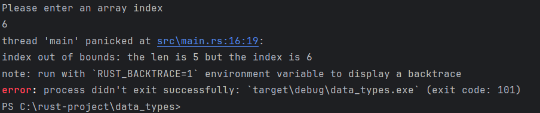

Program, indeksleme işleminde geçersiz bir değer kullanılması noktasında bir runtime error ile sonuçlandı.
Program bir hata mesajıyla çıktı ve son println! Statementini çalıştırmadı. İndeksleme kullanarak bir öğeye erişmeye
çalıştığınızda, Rust belirttiğiniz indeksin Array uzunluğundan küçük olup olmadığını kontrol eder. Eğer indeks
uzunluktan büyük veya eşitse, Rust panikleyecektir. Bu kontrol runtime da yapılmalıdır, özellikle bu durumda, çünkü
derleyici kullanıcının kodu daha sonra çalıştırdığında hangi değeri gireceğini bilemez.

# Functions

Fonksiyonlar Rust kodunda yaygındır. Dildeki en önemli fonksiyonlardan birini zaten gördünüz: birçok programın giriş
noktası olan main fonksiyonu. Ayrıca yeni fonksiyonlar tanımlamanızı sağlayan fn anahtar sözcüğünü de gördünüz.

Rust kodu, tüm harflerin küçük olduğu ve alt çizgilerin kelimeleri ayırdığı function ve variable adları için geleneksel
stil olarak snake case kullanır. İşte örnek bir fonksiyon tanımı içeren bir program:

````
fn main() {
    println!("Hello world");
    another_function();
}

fn another_function(){
    println!("Another function");
}
````

Rust'ta bir fonksiyonu fn yazıp ardından bir fonksiyon adı ve bir dizi parantez girerek tanımlarız. Küme parantezleri
derleyiciye fonksiyon gövdesinin nerede başlayıp nerede biteceğini söyler.

Tanımladığımız herhangi bir fonksiyonu, adını ve ardından bir dizi parantez girerek çağırabiliriz. another_function
program içinde tanımlandığı için, ana fonksiyonun içinden çağrılabilir. Another_function'u kaynak kodda main
fonksiyonundan sonra tanımladığımıza dikkat edin; daha önce de tanımlayabilirdik. Rust, fonksiyonlarınızı nerede
tanımladığınızla ilgilenmez, sadece çağıran tarafından görülebilecek bir kapsamda bir yerde tanımlanmış olmaları
yeterlidir.

Satırlar ana fonksiyonda göründükleri sırayla çalıştırılır. Önce "Hello, world!" mesajı yazdırılır, ardından
another_function çağrılır ve onun mesajı yazdırılır.

### Parameters

Fonksiyonları, fonksiyon imzasının bir parçası olan özel değişkenler olan parametrelere sahip olacak şekilde
tanımlayabiliriz. Bir fonksiyonun parametreleri olduğunda, bu parametreler için somut değerler sağlayabilirsiniz. Teknik
olarak, somut değerlere argüman denir, ancak günlük konuşmalarda insanlar parametre ve argüman kelimelerini ya bir
fonksiyonun tanımındaki değişkenler ya da bir fonksiyonu çağırdığınızda aktarılan somut değerler için birbirinin yerine
kullanma eğilimindedir.

another_function'un bu versiyonunda bir parametre ekliyoruz:

````
fn main() {
    println!("Hello world");
    another_function(5);
}

fn another_function(x : i32){
    println!("The value of parameter : {x}");
}
````

another_function bildiriminde x adında bir parametre vardır. x'in türü i32 olarak belirtilmiştir. 5 değerini
another_function öğesine aktardığımızda, println! makrosu 5 değerini x içeren küme parantezi çiftinin biçim dizesinde
bulunduğu yere yerleştirir.

Fonksiyon imzalarında, her parametrenin türünü bildirmeniz gerekir. Bu, Rust'ın tasarımında bilinçli bir karardır: işlev
tanımlarında tür ek açıklamaları gerektirmek, derleyicinin hangi türü kastettiğinizi anlamak için kodun başka bir
yerinde bunları kullanmanıza neredeyse hiç ihtiyaç duymaması anlamına gelir. Derleyici ayrıca fonksiyonun hangi tipleri
beklediğini bilirse daha yararlı hata mesajları verebilir.

Birden fazla parametre tanımlarken, parametre bildirimlerini aşağıdaki gibi virgülle ayırın:

````
fn main() {
    println!("Hello world");
    another_function(5,'g');
}

fn another_function(x : i32, unit_label : char){
    println!("The value of parameter : {x} and unit lable : {unit_label}");
}
````

İlk parametre x olarak adlandırılır ve bir i32'dir. İkincisi unit_label olarak adlandırılır ve char türündedir.
Fonksiyon daha sonra hem değeri hem de unit_label'ı içeren metni yazdırır.

### Statements and Expressions

Fonksiyon gövdeleri, isteğe bağlı olarak bir expression ile biten bir dizi Statement'dan oluşur. Şimdiye kadar ele
aldığımız fonksiyonlar bir son expression içermiyordu, ancak bir statement'in parçası olarak bir expression gördünüz.
Rust expression-based language olduğu için, bu anlaşılması gereken önemli bir ayrımdır. Diğer dillerde aynı ayrımlar
yoktur, bu nedenle statement'ların ve expression'ların ne olduğuna ve farklılıklarının fonksiyonların gövdelerini nasıl
etkilediğine bakalım.

* Statement'lar, bazı action'ları gerçekleştiren ve bir değer döndürmeyen talimatlardır.

* Expression'lar bir sonuç değerine göre değerlendirilir. Bazı örneklere bakalım

Aslında zaten statement'ları ve expression'ları kullandık. let anahtar sözcüğü ile bir değişken oluşturmak ve ona bir
değer atamak
bir statement'dir. Liste 3-1'de let y = 6; bir statement'dir.

````
fn main() {
    let y = 6;
}
````

Fonksiyon tanımları da statement'dir; önceki örneğin tamamı kendi içinde bir statement'dir.

Statement'lar değer döndürmez. Bu nedenle, aşağıdaki kodun yapmaya çalıştığı gibi bir let Statement'ini başka bir
değişkene atayamazsınız; hata alırsınız:

````
fn main() {
    let x = (let y = 6);
}
````

let y = 6 Statement'i bir değer döndürmez, bu nedenle x'in bind olacağı bir şey yoktur. Bu, atamanın atamanın değerini
döndürdüğü C ve Ruby gibi diğer dillerde olanlardan farklıdır. Bu dillerde, x = y = 6 yazabilir ve hem x hem de y'nin 6
değerine sahip olmasını sağlayabilirsiniz; Rust'ta durum böyle değildir.

Expression'lar bir değere göre değerlendirilir ve Rust'ta yazacağınız kodun geri kalanının çoğunu oluşturur. Örneğin 5 +
6 gibi bir matematik işlemini düşünün; bu, 11 değerine göre değerlendirilen bir Expression'dir. Expression'lar,
Statement'ların bir parçası olabilir:

let y = 6; Statement'inda ki 6, 6 değerine göre değerlendirilen bir Expression'dır

Bir fonksiyonun çağrılması bir Expression'dır. Makro çağırmak bir Expression'dır. Örneğin, küme parantezleriyle
oluşturulan yeni bir kapsam bloğu bir Expression'dir:

````
fn main() {
    let y = {
        let x = 3;
        x + 1
    };

    print!("The value of y is : {y}");
}
````

Çıktı olarak :

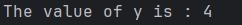

Burada ki expression:

````
{
    let x = 3;
    x + 1
}
````

bu durumda 4 olarak değerlendirilen bir bloktur. let statement'inin bir parçası olarak bu değer y'ye bağlanır. x + 1
satırının sonunda noktalı virgül olmadığına dikkat edin; bu, şu ana kadar gördüğünüz satırların çoğundan farklıdır.
Expression'lar sondaki noktalı virgülleri içermez. Bir expression'ın sonuna noktalı virgül eklerseniz, Expression'i bir
Statement'a dönüştürürsünüz ve bu durumda bir değer döndürmez. Bundan sonra fonksiyon dönüş değerlerini ve
Expression'lari keşfederken bunu aklınızda tutun.

### Dönüş Değerleri Olan Fonksiyonlar

Fonksiyonlar kendilerini çağıran koda değer döndürebilirler. Geri dönüş değerlerine isim vermeyiz, ancak türlerini bir
oktan (->) sonra bildirmeliyiz. Rust'ta, fonksiyonun geri dönüş değeri, fonksiyon gövdesinin bloğundaki son
Expression'ın değeri ile eş anlamlıdır. return anahtar sözcüğünü kullanarak ve bir değer belirterek bir fonksiyondan
erken dönebilirsiniz, ancak çoğu fonksiyon son expresion'i implicity olarak döndürür. İşte değer döndüren bir fonksiyon
örneği:

````
fn main() {
    let x = five();
    println!("The value of x : {x}");
}

fn five() -> i32 {
    5
}
````

five fonksiyonunda fonksiyon çağrıları, makrolar ve hatta let deyimleri yoktur; sadece 5 sayısı tek başına yer alır.
Bu Rust'ta tamamen geçerli bir fonksiyondur. Fonksiyonun dönüş tipinin de -> i32 olarak belirtildiğine dikkat edin. Bu
kodu çalıştırmayı deneyin;

five() 5, fonksiyonun geri dönüş değeridir, bu yüzden geri dönüş tipi i32'dir. Bunu daha ayrıntılı olarak inceleyelim.
İki önemli nokta var: Birincisi, let x = five(); satırı, bir değişkeni başlatmak için bir fonksiyonun geri dönüş
değerini kullandığımızı gösterir. five() fonksiyonu 5 döndürdüğü için, bu satır aşağıdakiyle aynıdır:

````
let x = 5;
````

İkinci olarak, five fonksiyonunun parametresi yoktur ve dönüş değerinin türünü tanımlar, ancak fonksiyonun gövdesi
noktalı virgül olmadan yalnız bir 5'tir, çünkü değeri döndürmek istediğimiz bir expression'dır.

Başka bir örneğe bakalım:

````
fn main() {
    let x = plus_one(5);
    println!("The value of x : {x}");
}

fn plus_one(x : i32) -> i32 {
    x + 1
}
````

Bu kod çalıştırıldığında x'in değeri şu şekilde yazdırılacaktır: 6. Ancak x + 1 Expression'ini içeren satırın sonuna
noktalı virgül koyarak expression'dan statement'a dönüştürürsek bir hata alırız:

# Control Flow

Bir koşulun doğru olup olmamasına bağlı olarak bazı kodları çalıştırma ve bir koşul doğruyken bazı kodları tekrar tekrar
çalıştırma yeteneği, çoğu programlama dilinde temel yapı taşlarıdır. Rust kodunun yürütme akışını kontrol etmenizi
sağlayan en yaygın yapılar if Expression'ları ve döngülerdir.

### If expressions

Bir if Expressionsi, koşullara bağlı olarak kodunuzu dallara ayırmanıza olanak tanır. Bir koşul sağlarsınız ve
ardından "Bu
koşul karşılanırsa, bu kod bloğunu çalıştırın. Koşul karşılanmazsa, bu kod bloğunu çalıştırmayın.

````
fn main() {
    let number = 3;

    if number < 5 {
        println!("Condition was true");
    } else {
        println!("Condition was false")
    }
}
````

Tüm if Expression'ları if anahtar kelimesiyle başlar ve ardından bir koşul gelir. Bu durumda koşul, sayı değişkeninin
5'ten küçük bir değere sahip olup olmadığını kontrol eder. Koşul doğruysa çalıştırılacak kod bloğunu, koşuldan hemen
sonra küme parantezleri içine yerleştiririz. If Expression'larındeki koşullarla ilişkili kod bloklarına bazen "arms" adı
verilir

İsteğe bağlı olarak, koşulun yanlış olarak değerlendirilmesi durumunda programa yürütülecek alternatif bir kod bloğu
vermek için burada yapmayı seçtiğimiz gibi bir else expression'ı da ekleyebiliriz. Bir else expression'ı sağlamazsanız
ve koşul yanlışsa, program if bloğunu atlayacak ve bir sonraki kod parçasına geçecektir.

Ayrıca, bu koddaki koşulun bir bool olması gerektiğini de belirtmek gerekir. Eğer koşul bir bool değilse, bir hata
alırız. Örneğin, aşağıdaki kodu çalıştırmayı deneyin:

````
fn main() {
    let number = 3;

    if number {
        println!("Condition was true");
    } else {
        println!("Condition was false")
    }
}
````

Hata, Rust'ın bir bool beklediğini ancak bir tamsayı aldığını gösterir. Ruby ve JavaScript gibi dillerin aksine, Rust
Boolean olmayan türleri otomatik olarak Boolean'a dönüştürmeye çalışmaz. Açık olmalı ve her zaman koşul olarak bir
Boolean ile if sağlamalısınız. Örneğin, if kod bloğunun yalnızca bir sayı 0'a eşit olmadığında çalışmasını istiyorsak,
if Expressionsini aşağıdaki gibi değiştirebiliriz:

````
fn main() {
    let number = 3;

    if number != 0 {
        println!("Number was something other than zero")
    }
}
````

Bu kodun kullanılmaması, sayının sıfırdan farklı bir şey olduğunu yazdıracaktır.

### Birden Fazla Koşulu else if ile İşleme

Bir else if Expression'ının da if ve else öğelerini birleştirerek birden fazla koşul kullanabilirsiniz. Örneğin:

````
fn main() {
    let number = 6;

    if number % 4 == 0 {
        println!("Number is divisible by 4");
    } else if number % 3 == 0 {
        println!("Number is divisible by 3");
    } else if number %2 == 0 {
        println!("Number is divisible by 2");
    } else {
        println!("Number off not divisible by 4,3 or 2");
    }
}
````

Bu programın izleyebileceği dört olası yol vardır. Çalıştırdıktan sonra aşağıdaki çıktıyı görmelisiniz:

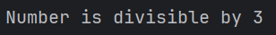

Bu program çalıştığında, her bir if Expression'ini sırayla kontrol eder ve koşulun doğru olarak değerlendirildiği ilk
gövdeyi çalıştırır. 6'nın 2'ye bölünebilir olmasına rağmen, çıktı sayısının 2'ye bölünebilir olduğunu görmediğimize veya
else bloğundan sayının 4, 3 veya 2'ye bölünemez olduğunu görmediğimize dikkat edin. Bunun nedeni, Rust'ın bloğu yalnızca
ilk doğru koşul için çalıştırması ve bir tane bulduğunda diğerlerini kontrol etmemesidir.

Çok fazla else if Expression'i kullanmak kodunuzu karmaşık hale getirebilir, bu nedenle birden fazla else if
Expression'iniz varsa kodunuzu yeniden düzenlemek isteyebilirsiniz. Bölüm 6, bu durumlar için match adı verilen güçlü
bir Rust branching yapısını açıklamaktadır.

### let Deyimi İçinde if Kullanma

if bir Expression olduğundan, Liste 3-2'de olduğu gibi, sonucu bir değişkene atamak için let deyiminin sağ tarafında
kullanabiliriz.

````
fn main() {
    let condition = true;
    let number = if condition {5} else {6};

    println!("Number : {number}")
}
````

Sayı değişkeni, if Expression'inin sonucuna bağlı olarak bir değere bound olacaktır. Ne olacağını görmek için bu kodu
çalıştırın:

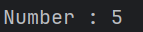

Kod bloklarının içlerindeki son Expressio'a göre değerlendirildiğini ve sayıların da kendi başlarına birer Expression
olduğunu unutmayın. Bu durumda, if Expression'inin tamamının değeri hangi kod bloğunun yürütüleceğine bağlıdır. Bu,
if'in her bir arm'ının sonucu olma potansiyeline sahip değerlerin aynı türde olması gerektiği anlamına gelir; Liste
3-2'de, hem if arm'ının hem de else arm'ının sonuçları i32 tamsayılarıdır. Aşağıdaki örnekte olduğu gibi türler
uyuşmazsa, bir hata alırız:

````
fn main() {
    let condition = true;
    let number = if condition { 5 } else { "six" };
    println!("The value of number is: {number}");
}
````

Bu kodu derlemeye çalıştığımızda bir hata alacağız. if ve else arms'ları uyumsuz değer türlerine sahiptir ve Rust,
programdaki sorunu tam olarak nerede bulacağımızı gösterir:

````
$ cargo run
   Compiling branches v0.1.0 (file:///projects/branches)
error[E0308]: `if` and `else` have incompatible types
 --> src/main.rs:4:44
  |
4 |     let number = if condition { 5 } else { "six" };
  |                                 -          ^^^^^ expected integer, found `&str`
  |                                 |
  |                                 expected because of this

For more information about this error, try `rustc --explain E0308`.
error: could not compile `branches` due to previous error
````

if bloğundaki Expression bir tamsayı olarak değerlendirilir ve else bloğundaki Expression bir String olarak
değerlendirilir. Bu işe yaramaz çünkü değişkenler tek bir türe sahip olmalıdır ve Rust'ın derleme sırasında number
değişkeninin türünü kesin olarak bilmesi gerekir. Sayının türünü bilmek, derleyicinin sayıyı kullandığımız her yerde
türün geçerli olduğunu doğrulamasını sağlar. Sayının türü yalnızca runtime da belirlenseydi Rust bunu yapamazdı;
derleyici daha karmaşık olurdu ve herhangi bir değişken için birden fazla varsayımsal türü takip etmek zorunda kalırsa
kod hakkında daha az garanti verirdi.

### Looplarla tekrarlama

Bir kod bloğunu birden fazla kez çalıştırmak genellikle yararlıdır. Bu görev için Rust, döngü gövdesi içindeki kodu
sonuna kadar çalıştıracak ve ardından hemen baştan başlayacak birkaç döngü sağlar.

Rust'ta üç tür döngü vardır: loop, while ve for. Her birini deneyelim.

* Loop ile Kod Tekrarı

Loop anahtar sözcüğü Rust'a bir kod bloğunu sonsuza kadar veya siz açıkça durmasını söyleyene kadar tekrar tekrar
çalıştırmasını söyler.

Örnek olarak, src/main.rs dosyasını aşağıdaki gibi değiştirin:

````
fn main() {
    loop {
        println!("infinity loop");
    }
}
````

Bu programı çalıştırdığımızda, programı manuel olarak durdurana kadar sürekli olarak tekrar tekrar yazdırıldığını
göreceğiz. Çoğu terminal, sürekli bir döngüde takılı kalan bir programı kesmek için ctrl-c klavye kısayolunu destekler.

Neyse ki Rust, kod kullanarak bir loopdan çıkmak için de bir yol sunar. Programa döngüyü yürütmeyi ne zaman
durduracağını söylemek için döngü içine break anahtar sözcüğünü yerleştirebilirsiniz. Kullanıcı doğru sayıyı tahmin
ederek oyunu kazandığında programdan çıkmak için Bölüm 2'deki "Doğru Tahminden Sonra Çıkmak" bölümündeki tahmin oyununda
bunu yaptığımızı hatırlayın.

Tahmin oyununda ayrıca, bir loop'da programa loop'un bu iteration'ının da kalan tüm kodları atlamasını ve bir sonraki
loop'a geçmesini söyleyen continue Expression'ini kullandık.

* Döngülerden Değer Döndürme :

Döngünün kullanım alanlarından biri, bir iş parçacığının işini tamamlayıp tamamlamadığını kontrol etmek gibi başarısız
olabileceğini bildiğiniz bir işlemi yeniden denemektir. Ayrıca bu işlemin sonucunu döngüden kodunuzun geri kalanına
aktarmanız gerekebilir. Bunu yapmak için, döngüyü durdurmak için kullandığınız break Expression'inden sonra
döndürülmesini istediğiniz değeri ekleyebilirsiniz; bu değer, burada gösterildiği gibi kullanabilmeniz için döngü
dışında döndürülür:

````
fn main() {
   let mut counter = 0;

    let result = loop {
        counter += 1;

        if counter == 10{
            break counter * 3;
        }
    };

    println! ("Result : {result}")
}
````

Döngüden önce, counter adında bir değişken tanımlıyoruz ve 0 olarak başlatıyoruz. Ardından, döngüden dönen değeri tutmak
için result adında bir değişken tanımlıyoruz. Döngünün her yinelemesinde, counter değişkenine 1 ekliyoruz ve ardından
sayacın 10'a eşit olup olmadığını kontrol ediyoruz. Eşit olduğunda, counter * 2 değeriyle break anahtar sözcüğünü
kullanıyoruz. Döngüden sonra, değeri result'a atayan Expression'i sonlandırmak için noktalı virgül kullanıyoruz. Son
olarak, bu durumda 20 olan result değerini yazdırıyoruz.

* Çoklu Loop'lar Arasında Anlam Ayrımı Yapmak için Loop Etiketleri

Döngüler içinde döngüleriniz varsa, break ve continue o noktada en içteki döngüye uygulanır. İsteğe bağlı olarak, bir
döngü üzerinde break veya continue ile birlikte kullanabileceğiniz bir döngü etiketi belirtebilir ve bu anahtar
sözcüklerin en içteki döngü yerine etiketli döngüye uygulanacağını belirtebilirsiniz. Döngü etiketleri tek tırnak
işaretiyle başlamalıdır. Burada iç içe geçmiş iki döngü içeren bir örnek verilmiştir:

````
fn main() {
    let mut count = 0;
    'counting_up: loop {
        println!("count : {count}");
        let mut remaining = 10;
        loop {
            println!("remaining : {remaining}");
            if remaining == 9 { break; }
            if count == 2 { break 'counting_up; }
            remaining -= 1;
        }
        count += 1;
    }
    println!("End count : {count}");
}
````

Outer loop 'counting_up' etiketine sahiptir ve 0'dan 2'ye kadar sayar. Etiketi olmayan inner loop 10'dan 9'a kadar
sayar. Etiket belirtmeyen ilk break yalnızca inner loopdan çıkacaktır. break 'counting_up; Expression'i outer loop'dan
çıkacaktır. Bu kod yazdırılır:

````
$ cargo run
   Compiling loops v0.1.0 (file:///projects/loops)
    Finished dev [unoptimized + debuginfo] target(s) in 0.58s
     Running `target/debug/loops`
count = 0
remaining = 10
remaining = 9
count = 1
remaining = 10
remaining = 9
count = 2
remaining = 10
End count = 2
````

### while ile Koşullu Döngüler

Bir programın genellikle bir döngü içinde bir koşulu değerlendirmesi gerekir. Koşul doğru olduğu sürece döngü çalışır.
Koşul doğru olmaktan çıktığında, program break komutunu çağırarak döngüyü durdurur. Bunun gibi bir davranışı döngü, if,
else ve break'in bir kombinasyonunu kullanarak uygulamak mümkündür; isterseniz bunu şimdi bir programda
deneyebilirsiniz. Ancak, bu kalıp o kadar yaygındır ki, Rust bunun için while döngüsü adı verilen yerleşik bir dil
yapısına sahiptir. Liste 3-3'te, while'ı programı üç kez döngüye sokmak için kullanıyoruz, her seferinde geri sayıyoruz
ve döngüden sonra bir mesaj yazdırıp çıkıyoruz.

````
fn main() {
    let mut number = 3;

    while number != 0 {
        println!("Number : {number}");
        number -= 1;
    }
    println!("LIFTOFF");
}
````

Bu yapı, loop, if, else ve break kullanmanız durumunda gerekli olacak birçok iç içe geçmeyi ortadan kaldırır ve daha
nettir. Bir koşul doğru olarak değerlendirilirken kod çalışır; aksi takdirde döngüden çıkılır.

### for ile Koleksiyonda Döngü Oluşturma

Array gibi bir koleksiyonun öğeleri üzerinde döngü oluşturmak için while yapısını kullanmayı seçebilirsiniz. Örneğin,
Liste 3-4'teki döngü 'a' array'inde ki her bir öğeyi yazdırır.

````
fn main() {
    let a = [1, 2, 3, 4, 5];
    let mut index = 0;

    while index < a.len() {
        println!("Array elements : {}", a[index]);
        index += 1;
    }
}
````

Burada kod, Array'de ki öğeler boyunca sayar. Index 0'dan başlar ve Array'de ki son index'e ulaşana kadar (yani, index <
a.len() artık doğru olmadığında) döngüye devam eder. Bu kodu çalıştırmak Array'de ki her öğeyi yazdıracaktır:

Daha özlü bir alternatif olarak, bir for döngüsü kullanabilir ve koleksiyondaki her öğe için bazı kodlar
çalıştırabilirsiniz. Bir for döngüsü Liste 3-5'teki koda benzer.

````
fn main() {
    let a = [1, 2, 3, 4, 5];

    for element in a {
        println!("Array elements : {element}");
    }
}
````

for döngülerinin güvenliği ve kısalığı, onları Rust'ta en sık kullanılan döngü yapısı haline getirir. Liste 3-3'te while
döngüsü kullanan geri sayım örneğinde olduğu gibi, bazı kodları belirli sayıda çalıştırmak istediğiniz durumlarda bile,
çoğu Rustacean bir for döngüsü kullanır. Bunu yapmanın yolu, standart kütüphane tarafından sağlanan ve bir sayıdan
başlayıp başka bir sayıdan önce biten tüm sayıları sırayla üreten bir Range kullanmaktır.

İşte bir for döngüsü ve aralığı tersine çevirmek için henüz bahsetmediğimiz başka bir yöntem olan rev kullanılarak geri
sayımın nasıl görüneceği:

````
fn main() {
   for number in (1..4).rev() {
       println!("number : {number}");
   }
}
````

````
number : 3
number : 2
number : 1
````

# Ownership nedir?

Ownership, bir Rust programının belleği nasıl yönettiğini düzenleyen bir dizi kuraldır. Tüm programlar çalışırken
bilgisayarın belleğini kullanma şeklini yönetmek zorundadır. Bazı dillerde, program çalışırken artık kullanılmayan
belleği düzenli olarak arayan çöp toplama sistemi vardır; diğer dillerde ise programcının belleği açıkça tahsis etmesi
ve boşaltması gerekir. Rust üçüncü bir yaklaşım kullanır: bellek, derleyicinin kontrol ettiği bir dizi kurala sahip bir
Ownership sistemi aracılığıyla yönetilir. Kurallardan herhangi biri ihlal edilirse, program derlenmez. Ownership
özelliklerinin hiçbiri programınızı çalışırken yavaşlatmaz.

Ownership birçok programcı için yeni bir kavram olduğundan, alışmak biraz zaman alır. İyi haber şu ki, Rust ve Ownership
sisteminin kuralları konusunda ne kadar deneyimli olursanız, doğal olarak güvenli ve verimli kod geliştirmeyi o kadar
kolay bulacaksınız. Devam edin!

Ownership'i anladığınızda, Rust'ı benzersiz kılan özellikleri anlamak için sağlam bir temele sahip olacaksınız. Bu
bölümde, çok yaygın bir veri yapısına odaklanan bazı örnekler üzerinde çalışarak Ownership'i öğreneceksiniz: stringler.

## Stack ve Heap

Birçok programlama dili stack ve heap hakkında çok sık düşünmenizi gerektirmez. Ancak Rust gibi bir sistem programlama
dilinde, bir değerin stack de mi yoksa heap de mi olduğu dilin nasıl davrandığını ve neden belirli kararlar vermeniz
gerektiğini etkiler. Ownership'in parçaları bu bölümün ilerleyen kısımlarında stack ve heap ile ilişkili olarak
açıklanacaktır, bu nedenle burada hazırlık için kısa bir açıklama bulunmaktadır.

Hem stack hem de heap, kodunuzun çalışma zamanında kullanabileceği bellek parçalarıdır, ancak farklı şekillerde
yapılandırılmışlardır. Stack, değerleri aldığı sırayla saklar ve değerleri ters sırayla siler. Bu, son giren ilk çıkar
olarak adlandırılır. Bir tabak yığını düşünün: daha fazla tabak eklediğinizde, onları yığının üstüne koyarsınız ve bir
tabağa ihtiyacınız olduğunda, üstten bir tane alırsınız. Ortadan veya alttan tabak eklemek veya çıkarmak pek işe
yaramaz! Veri eklemeye stack'e pushing, veriyi çıkarmaya ise stack'ten popping etme denir. Stack'de depolanan tüm
veriler bilinen, sabit bir boyuta sahip olmalıdır. Derleme zamanında boyutu bilinmeyen veya boyutu değişebilecek veriler
stack yerine heap'de saklanmalıdır.

Heap daha az düzenlidir: Heap'e veri koyduğunuzda, belirli bir miktar alan talep edersiniz. Bellek ayırıcı, stack'de
yeterince büyük boş bir nokta bulur, kullanımda olduğunu işaretler ve o konumun adresi olan bir pointer döndürür. Bu
işleme heap üzerinde allocating denir. (değerleri stack'e pushlamak allocating olarak kabul edilmez). Heap'in pointer'i
bilinen, sabit bir boyutta olduğu için pointer'i stack'de saklayabilirsiniz, ancak gerçek veriyi istediğinizde pointer'i
takip etmeniz gerekir. Bir restoranda oturduğunuzu düşünün. İçeri girdiğinizde, grubunuzdaki kişi sayısını belirtirsiniz
ve ev sahibi herkese uyan boş bir masa bulur ve sizi oraya yönlendirir. Grubunuzdan biri geç gelirse, sizi bulmak için
nereye oturduğunuzu sorabilir.

Stack'e push etmek, heap'de ayırmaktan daha hızlıdır çünkü allocator yeni verileri depolamak için asla bir yer aramak
zorunda kalmaz; bu konum her zaman stack'in en üstündedir. Buna kıyasla, heap'de yer ayırmak daha fazla çalışma
gerektirir çünkü allocator önce veriyi tutmak için yeterince büyük bir alan bulmalı ve ardından bir sonraki allocation'a
hazırlanmak için defter tutma işlemini gerçekleştirmelidir.

Heap'de ki verilere erişmek stack'de ki verilere erişmekten daha yavaştır çünkü oraya ulaşmak için bir pointer'i takip
etmeniz gerekir. Çağdaş işlemciler bellekte daha az atlama yaparlarsa daha hızlıdırlar. Benzetmeye devam edersek, bir
restoranda birçok masadan sipariş alan bir server'i düşünün. Bir sonraki masaya geçmeden önce bir masadaki tüm
siparişleri almak en verimli yöntemdir. A masasından bir sipariş almak, sonra B masasından bir sipariş almak, sonra
tekrar A'dan bir sipariş almak ve sonra tekrar B'den bir sipariş almak çok daha yavaş bir işlem olacaktır. Aynı şekilde,
bir işlemci daha uzaktaki (heap'de olabileceği gibi) veriler yerine diğer verilere yakın olan (stack'de olduğu gibi)
veriler üzerinde çalışırsa işini daha iyi yapabilir.

Kodunuz bir fonksiyonu çağırdığında, fonksiyona aktarılan değerler (potansiyel olarak heap üzerindeki verilere
pointer'lar da dahil olmak üzere) ve fonksiyonun local variable'ları stack'e pushlanır. İşlev sona erdiğinde, bu
değerler stack'den çıkarılır.

Kodun hangi bölümlerinin heap'de hangi verileri kullandığını takip etmek, heap'de ki yinelenen veri miktarını en aza
indirmek ve alanınızın tükenmemesi için heap'de ki kullanılmayan verileri temizlemek Ownership'in ele aldığı
sorunlardır.

Ownership'i anladıktan sonra, stack ve heap hakkında çok sık düşünmeniz gerekmeyecektir, ancak Ownership'in temel
amacının heap verilerini yönetmek olduğunu bilmek, neden bu şekilde çalıştığını açıklamaya yardımcı olabilir.

## Ownership Kuralları

İlk olarak, Ownership kurallarına bir göz atalım. Örnekler üzerinde çalışırken bu kuralları aklınızda tutun:

* Rust'taki her değerin bir Owner'i vardır.

* Aynı anda sadece bir Owner'i olabilir.

* Owner scope dışına çıktığında, değer düşecektir.

## Variable (Değişken) Scope

Artık temel Rust syntax'ına geçtiğimize göre, fn main() { kodunun tamamını örneklere dahil etmeyeceğiz, bu nedenle
takip ediyorsanız, aşağıdaki örnekleri manuel olarak bir main işlevinin içine koyduğunuzdan emin olun. Sonuç olarak,
örneklerimiz biraz daha kısa olacak ve şablon kod yerine gerçek ayrıntılara odaklanmamızı sağlayacak.

Ownership'in ilk örneği olarak, bazı değişkenlerin scope'una bakacağız. Scope, bir program içinde bir öğenin geçerli
olduğu aralıktır. Aşağıdaki değişkeni ele alalım:

````
{
    /* s burada geçerli değildir, henüz declare edilmemiştir */
    let s = "hello"; // s bu noktadan itibaren geçerlidir
    // s ile bir şeyler yap
} // bu kapsam artık sona ermiştir ve s artık geçerli değildir
````

Başka bir deyişle, burada zaman içinde iki önemli nokta vardır:

* s kapsama girdiğinde geçerlidir.

* Scope dışına çıkana kadar geçerli kalır.

Bu noktada, scope'lar ve variable'ların ne zaman geçerli olduğu arasındaki ilişki diğer programlama dillerindekine
benzer. Şimdi String tipini tanıtarak bu anlayışın üzerine inşa edeceğiz.

## String type

Ownership kurallarını göstermek için, Bölüm 3'ün "Veri Tipleri" bölümünde ele aldıklarımızdan daha karmaşık bir veri
tipine ihtiyacımız var. Daha önce ele alınan tipler bilinen bir boyuta sahiptir, stack'de saklanabilir ve scope'ları
sona erdiğinde stack'den çıkarılabilir ve kodun başka bir bölümünün aynı değeri farklı bir scope'da kullanması
gerektiğinde yeni, bağımsız bir instance oluşturmak için hızlı ve önemsiz bir şekilde kopyalanabilir. Ancak biz heap'de
depolanan verilere bakmak ve Rust'ın bu verileri ne zaman temizleyeceğini nasıl bildiğini keşfetmek istiyoruz ve String
türü buna harika bir örnektir.

String'in Ownership'le ilgili kısımlarına odaklanacağız. Bu hususlar, ister standart kütüphane tarafından sağlansın
ister sizin tarafınızdan oluşturulsun, diğer complex veri türleri için de geçerlidir. String'i Bölüm 8'de daha
derinlemesine tartışacağız.

Bir String değerinin programımıza sabit olarak kodlandığı String literal'leri daha önce görmüştük. String değişmezleri
kullanışlıdır, ancak metin kullanmak isteyebileceğimiz her durum için uygun değildir. Bunun bir nedeni değişmez
olmalarıdır. Bir diğeri ise kodumuzu yazarken her string değerinin bilinemeyeceğidir: örneğin, kullanıcı girdisini almak
ve saklamak istersek ne olur? Bu gibi durumlar için Rust, 'String' adında ikinci bir string türüne sahiptir. Bu tür,
heap üzerinde ayrılan verileri yönetir ve bu nedenle derleme zamanında bizim için bilinmeyen bir miktar metni
depolayabilir. Aşağıdaki gibi from fonksiyonunu kullanarak bir string literalden bir 'String' oluşturabilirsiniz:

````
fn main() {
    let s = String::from("hello");
}
````

Çift iki nokta :: operatörü, string_from gibi bir isim kullanmak yerine bu özel from fonksiyonunu String tipi altında
isimlendirmemizi sağlar. Bu sözdizimini Bölüm 5'teki "Metot Sözdizimi" bölümünde ve Bölüm 7'deki "Modül Ağacında Bir
Öğeye Başvurma Yolları" bölümünde modüllerle isimlendirme hakkında konuşurken daha fazla tartışacağız.

Bu tür bir string mutated edilebilir:

````
fn main() {
    let mut s = String::from("Hello");
    s.push_str(", world!"); // push_str() bir String'e bir literal (değişmez) ekler
}
````

Peki, buradaki fark nedir? Neden String mutasyona uğratılabilirken literaller (değişmezler) uğratılamıyor? Aradaki fark,
bu iki türün bellekle nasıl başa çıktığıdır.

Bir String literal söz konusu olduğunda, içeriği compile time da biliriz, bu nedenle metin doğrudan son
executable dosyaya kodlanır. String literallerin hızlı ve verimli olmasının nedeni budur. Ancak bu özellikler
yalnızca string literal'ın immutable olmasından kaynaklanır. Ne yazık ki, derleme sırasında boyutu bilinmeyen ve program
çalışırken boyutu değişebilecek her metin parçası için binary dosyaya bir bellek bloğu koyamayız.

String tipinde, değişebilir ve büyüyebilir bir metin parçasını desteklemek için, içeriği tutmak üzere heap üzerinde
derleme zamanında bilinmeyen bir miktar bellek ayırmamız gerekir. Bu şu anlama gelir:

* Memory, çalışma zamanında memory allocator'dan talep edilmelidir.

* String'imizle işimiz bittiğinde bu belleği allocator'a geri döndürmenin bir yoluna ihtiyacımız var.

Bu ilk kısım bizim tarafımızdan yapılır: String::from'u çağırdığımızda, implementasyonu ihtiyaç duyduğu belleği talep
eder. Bu, programlama dillerinde hemen hemen evrenseldir.

Ancak ikinci kısım farklıdır. Çöp toplayıcısı (GC) olan dillerde, GC artık kullanılmayan belleği takip eder ve temizler
ve bizim bunu düşünmemize gerek yoktur. GC'si olmayan çoğu dilde, belleğin artık kullanılmadığını tespit etmek ve tıpkı
bellek talep ederken yaptığımız gibi, onu açıkça serbest bırakmak için kod çağırmak bizim sorumluluğumuzdadır. Bunu
doğru bir şekilde yapmak tarihsel olarak zor bir programlama sorunu olmuştur. Eğer unutursak, belleği boşa harcamış
oluruz. Eğer çok erken yaparsak, geçersiz bir değişkene sahip oluruz. Eğer iki kez yaparsak, bu da bir hatadır. Tam
olarak bir allocate ile tam olarak bir free'yi eşleştirmemiz gerekir.

Rust farklı bir yol izler: bellek, ona sahip olan değişken kapsam dışına çıktığında otomatik olarak geri döndürülür.
İşte Liste 4-1'deki kapsam örneğimizin string literal yerine String kullanan bir versiyonu:

````
fn main() {
    {
        let s = String::from("Hello"); // s bu noktadan itibaren geçerlidir
        // s ile ilgili birşeyler yapın
    } // bu kapsam artık sona ermiştir ve s artık geçerli değildir
}
````

String'imizin ihtiyaç duyduğu belleği allocator'a geri verebileceğimiz doğal bir nokta vardır: s scope dışına
çıktığında. Bir değişken scope dışına çıktığında, Rust bizim için özel bir fonksiyon çağırır. Bu fonksiyon 'drop' olarak
adlandırılır ve String'in yazarının belleği geri döndürmek için kodu koyabileceği yerdir. Rust, drop fonksiyonunu
otomatik olarak küme parantezinin kapanışında çağırır.

Bu modelin Rust kodunun yazılma şekli üzerinde derin bir etkisi vardır. Şu anda basit görünebilir, ancak birden fazla
değişkenin heap üzerinde ayırdığımız verileri kullanmasını istediğimiz daha karmaşık durumlarda kodun davranışı
beklenmedik olabilir. Şimdi bu durumlardan bazılarını inceleyelim.

## Move ile Etkileşime Giren Değişkenler ve Veriler

Rust'ta birden fazla değişken aynı veri ile farklı şekillerde etkileşime girebilir. Liste 4-2'de bir tamsayı kullanan
bir örneğe bakalım.

````
fn main() {
    let x = 5;
    let y = x;
}
````

Bunun ne yaptığını muhtemelen tahmin edebiliriz: "5 değerini x'e bağla; sonra x'teki değerin bir kopyasını oluştur ve
onu y'ye bağla." Artık x ve y olmak üzere iki değişkenimiz var ve ikisi de 5'e eşit. Gerçekten de olan budur, çünkü
tamsayılar bilinen, sabit bir boyuta sahip basit değerlerdir ve bu iki 5 değeri stack'e push edilir.

Şimdi String versiyonuna bakalım:

````
fn main() {
    let s1 = String::from("Hello, World!");
    let s2 = s1;
}
````

Bu çok benzer görünüyor, bu nedenle çalışma şeklinin aynı olacağını varsayabiliriz: yani, ikinci satır s1'deki değerin
bir kopyasını oluşturacak ve onu s2'ye bağlayacaktır. Ancak olan tam olarak bu değildir.

Şekil 4-1'e bakarak, String'e örtülerin altında neler olduğunu görebilirsiniz. Bir String, solda gösterilen üç parçadan
oluşur: String'in içeriğini tutan belleğe bir pointer, bir len ve bir capacity. Bu veri grubu stack üzerinde
saklanır. Sağ tarafta ise heap üzerinde içeriği tutan bellek yer alır.

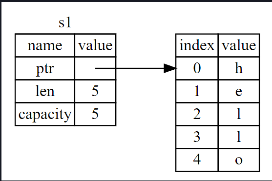

len, String'in içeriğinin şu anda bayt cinsinden ne kadar bellek kullandığını gösterir. Capacity, String'in
allocator'dan aldığı bayt cinsinden toplam bellek miktarıdır. len ve capacity arasındaki fark önemlidir, ancak bu
bağlamda değil, bu nedenle şimdilik capacity'i görmezden gelmek iyidir.

s1'i s2'ye atadığımızda, String verisi kopyalanır, yani pointer'i, len ve stack'de bulunan kapasiteyi kopyalarız.
Pointer'in başvurduğu heap üzerindeki verileri kopyalamayız. Başka bir deyişle, bellekteki veri gösterimi Şekil
4-2'deki gibi görünür.

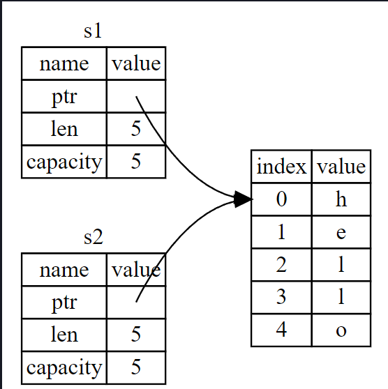

Bu gösterim Şekil 4-3'e benzemez, eğer Rust bunun yerine heap verilerini de kopyalasaydı bellek bu şekilde görünürdü.
Rust bunu yapsaydı, s2 = s1 işlemi, heap'de ki veriler büyükse çalışma zamanı performansı açısından çok pahalı
olabilirdi.

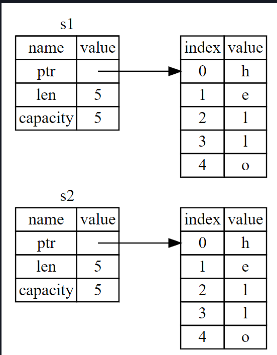

Daha önce, bir değişken kapsam dışına çıktığında Rust'ın otomatik olarak drop fonksiyonunu çağırdığını ve bu değişken
için heap belleğini temizlediğini söylemiştik. Ancak Şekil 4-2, her iki veri pointer'inin de aynı konuma işaret
ettiğini göstermektedir. Bu bir sorundur: s2 ve s1 kapsam dışına çıktığında, her ikisi de aynı belleği boşaltmaya
çalışacaktır. Bu, double free error hatası olarak bilinir ve daha önce bahsettiğimiz bellek güvenliği hatalarından
biridir. Belleğin iki kez serbest bırakılması bellek bozulmasına yol açabilir ve bu da potansiyel olarak güvenlik
açıklarına neden olabilir.

Bellek güvenliğini sağlamak için, let s2 = s1; satırından sonra, Rust s1'i artık geçerli değil olarak kabul eder. Bu
nedenle, s1 kapsam dışına çıktığında Rust'ın herhangi bir şeyi serbest bırakması gerekmez. s2 oluşturulduktan sonra s1'i
kullanmaya çalıştığınızda ne olacağını kontrol edin; çalışmayacaktır:

````
fn main() {
    let s1 = String::from("Hello, World!");
    let s2 = s1;
    println!("{}", s1);
}
````

Bunun gibi bir hata alırsınız çünkü Rust geçersiz referansı kullanmanızı engeller:

````
$ cargo run
   Compiling ownership v0.1.0 (file:///projects/ownership)
error[E0382]: borrow of moved value: `s1`
 --> src/main.rs:5:28
  |
2 |     let s1 = String::from("hello");
  |         -- move occurs because `s1` has type `String`, which does not implement the `Copy` trait
3 |     let s2 = s1;
  |              -- value moved here
4 |
5 |     println!("{}, world!", s1);
  |                            ^^ value borrowed here after move
  |
  = note: this error originates in the macro `$crate::format_args_nl` which comes from the expansion of the macro 
  `println` (in Nightly builds, run with -Z macro-backtrace for more info)
help: consider cloning the value if the performance cost is acceptable
  |
3 |     let s2 = s1.clone();
  |                ++++++++

For more information about this error, try `rustc --explain E0382`.
error: could not compile `ownership` due to previous error
````

Diğer dillerle çalışırken shallow copy ve deep copy terimlerini duyduysanız, verileri kopyalamadan pointer'i, len
ve capacity'i kopyalama kavramı muhtemelen shallow copy yapmak gibi geliyordur. Ancak Rust ilk değişkeni de geçersiz
kıldığı için, shallow copy olarak adlandırılmak yerine, 'move' olarak bilinir. Bu örnekte, s1'in s2'ye taşındığını
söyleyebiliriz. Gerçekte ne olduğu Şekil 4-4'te gösterilmiştir.

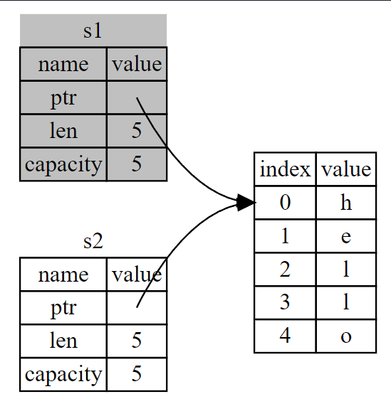

Bu sorunumuzu çözer! Sadece s2 geçerliyken, kapsam dışına çıktığında tek başına belleği boşaltacak ve işimiz bitecek.

Buna ek olarak, bununla ima edilen bir tasarım seçimi vardır: Rust hiçbir zaman verilerinizin "deep" kopyalarını
otomatik olarak oluşturmaz. Bu nedenle, herhangi bir otomatik kopyalamanın çalışma zamanı performansı açısından ucuz
olduğu varsayılabilir.

## Clone ile Etkileşime Giren Variable'lar ve Data

Eğer String'in sadece stack verisini değil, heap verisini de deeply copy istiyorsak, clone adı verilen yaygın bir metodu
kullanabiliriz. Metot sözdizimini Bölüm 5'te tartışacağız, ancak metotlar birçok programlama dilinde ortak bir özellik
olduğundan, muhtemelen bunları daha önce görmüşsünüzdür.

İşte clone methodunun iş başında olduğu bir örnek:

````
fn main() {
    let s1 = String::from("Hello, World!");
    let s2 = s1.clone();
    println!("{}", s1);
    println!("{}", s2);
}
````

Bu gayet iyi çalışır ve Şekil aşağıda gösterilen, heap datasının kopyalandığı davranışı açıkça üretir.

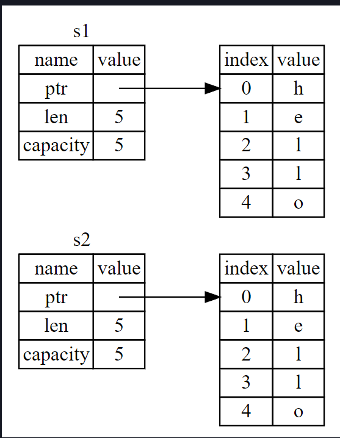

Bir clone call'u gördüğünüzde, bazı rastgele kodların yürütüldüğünü ve bu kodun pahalı olabileceğini bilirsiniz. Bu,
farklı bir şeylerin döndüğünün görsel bir göstergesidir.

## Yalnızca Stack Data: Kopyala

Henüz bahsetmediğimiz başka bir sorun daha var. Bir kısmı aşağıda gösterilen tamsayıları kullanan bu kod çalışır ve
geçerlidir:

````
fn main() {
    let x = 5;
    let y = x;
    println!("X : {} & Y : {}", x, y);
}
````

Ancak bu kod az önce öğrendiklerimizle çelişiyor gibi görünüyor: clone call yok, ancak x hala geçerli ve y'ye move
edilmedi.

Bunun nedeni, derleme zamanında bilinen bir boyuta sahip olan tamsayılar gibi türlerin tamamen stack'de depolanmasıdır,
bu nedenle gerçek değerlerin kopyalarının oluşturulması hızlıdır. Başka bir deyişle, burada deep ve shallow kopyalama
arasında bir fark yoktur, bu nedenle clone'u çağırmak normal shallow kopyalamadan farklı bir şey yapmaz ve bunu dışarıda
bırakabiliriz.

Rust, tamsayılar gibi stack'de saklanan türlere yerleştirebileceğimiz Copy özelliği adı verilen özel bir annotation'a
sahiptir (Bölüm 10'da özellikler hakkında daha fazla konuşacağız). Bir tür Copy özelliğini implement ederse, onu
kullanan değişkenler move edilmez, bunun yerine önemsiz bir şekilde kopyalanır ve başka bir değişkene atandıktan sonra
hala geçerli olurlar.

Rust, tür veya türün herhangi bir parçası Drop özelliğini uyguladıysa, bir türe Copy ile annotation eklememize izin
vermez. Değer kapsam dışına çıktığında türün özel bir şey yapması gerekiyorsa ve bu türe Copy annotation'ını eklersek,
derleme zamanı hatası alırız. Özelliği uygulamak üzere türünüze Copy annotation'ını nasıl ekleyeceğinizi öğrenmek için
Ek C'deki “Derivable Traits (Türetilebilir Özellikler)" bölümüne bakın.

Peki, hangi türler Copy özelliğini implement eder? Emin olmak için ilgili türün belgelerini kontrol edebilirsiniz, ancak
genel bir kural olarak, basit scalar değerlerden oluşan herhangi bir grup Copy özelliğini implement edebilir ve tahsis
gerektiren veya bir tür kaynak olan hiçbir şey Copy özelliğini implement edemez. İşte Copy özelliğini uygulayan
türlerden bazıları:

* u32 gibi tüm tamsayı türleri.

* Boolean türü, bool, true ve false değerlerini içerir.

* f64 gibi tüm floating-point türleri

* Character type 'char'

* Tuple'lar, yalnızca Copy'yi de implement eden türleri içeriyorlarsa. Örneğin, (i32, i32) Copy'yi implement eder,
  ancak (i32, String) implement etmez

## Ownership ve Functions

Bir fonksiyona değer aktarma mekaniği, bir değişkene değer atama mekaniğine benzer. Bir değişkeni bir fonksiyona
geçirmek, tıpkı atamanın yaptığı gibi değişkeni taşır veya kopyalar. Aşağı da, değişkenlerin scope içine girdiği ve
scope dışına çıktığı yerleri gösteren bazı annotation'lar içeren bir örnek bulunmaktadır.

````
fn main() {
    let s = String::from("hello"); // s scope'a girer

    takes_ownership(s); // s'nin değeri fonksiyona taşınır...
    // ... ve bu yüzden artık burada 's' geçerli değil

    let x = 5; // x scope'a girer

    makes_copy(x); // x fonksiyonun içine doğru move edecektir,
    // ancak i32 Copy'dir, bu nedenle daha sonra hala x kullanmanızda sorun yoktur

} // burada x scope dışına çıkar

fn takes_ownership(some_string : String) { // some_string scope'a girer
    println!("incoming string : {some_string}")
} // Burada, some_string scope dışına çıkar ve `drop` çağrılır. Backing memory serbest bırakılır.

fn makes_copy(some_int : i32){ // some_int scopa'a girer
    println!("incoming integer : {some_int}");
} // Burada, some_integer kapsam dışına çıkar. Özel bir şey olmaz.
````

Eğer takes_ownership çağrısından sonra s kullanmaya çalışsaydık, Rust derleme zamanı hatası verirdi. Bu statik
kontroller bizi hatalardan korur. Bunları nerede kullanabileceğinizi ve ownership kurallarının bunu yapmanızı nerede
engellediğini görmek için main'e s ve x kullanan kod eklemeyi deneyin.

## Return Values ve Scope

Değer döndürmek de ownership'i aktarabilir.

````
fn main() {
    let _s1 = gives_ownership(); // gives_ownership return value'yu s1'e move eder

    let s2 = String::from("hello"); // s2 scope içine girer

    // s2 takes_and_gives_back içine taşınır, bu da dönüş değerini s3 içine taşır
    let s3 = takes_and_gives_back(s2);
} /* Burada, s3 scope dışına çıkar ve drop edilir. s2 move edildi, bu nedenle hiçbir şey olmaz.
s1 scope dışına çıkar ve drop edilir */

/* gives_ownership return value'sunu kendisini çağıran fonksiyona move edecektir*/
fn gives_ownership() -> String {
    let some_string = String::from("yours"); //some_string scope içine girer
    some_string // some_string döndürülür ve çağıran işleve move edilir
}

/* Bu fonksiyon bir String alır ve bir String döndürür */
fn takes_and_gives_back(a_string: String) -> String { // a_string scope içine girer
    a_string //  a_string döndürülür ve çağıran işleve move edilir
}
````

Bir değişkenin ownership'i her seferinde aynı modeli izler: bir değeri başka bir değişkene atamak onu move eder. Heap
üzerinde veri içeren bir değişken scope dışına çıktığında, verinin ownership'i başka bir değişkene move edilmediği
sürece değer 'drop' tarafından temizlenecektir.

Bu işe yarasa da, ownership almak ve ardından her function ile ownership'i geri vermek biraz sıkıcıdır. Ya bir
fonksiyonun bir değeri kullanmasına izin vermek ama ownership'ini almamak istiyorsak? Fonksiyonun gövdesinden
kaynaklanan ve geri döndürmek isteyebileceğimiz herhangi bir veriye ek olarak, tekrar kullanmak istediğimizde içeri
aktardığımız herhangi bir şeyin de geri aktarılması gerekmesi oldukça can sıkıcıdır.

Rust, aşağıda gösterildiği gibi bir tuple kullanarak birden fazla değer döndürmemize izin verir.

````
fn main() {
    let s1 = String::from("hello");

    let (s2,len) = calculate_length (s1);

    println!("The length of '{}' is {}.", s2, len);
}

fn calculate_length (s: String) -> (String,usize) {
    let length = s.len();
    (s,length)
}
````

Ancak bu çok fazla seremoni ve yaygın olması gereken bir kavram için çok fazla iş. Şanslıyız ki Rust'ta bir değeri
sahipliğini devretmeden kullanmak için 'referans' adı verilen bir özellik var.
