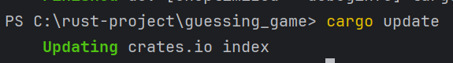
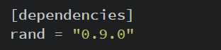

Rust, varsayılan olarak standart kütüphanede tanımlanan ve her programın kapsamına giren bir dizi öğeye sahiptir. Bu
kümeye "prelude" denir ve içindeki her şeyi standart kütüphane belgelerinde görebilirsiniz.

https://doc.rust-lang.org/std/prelude/index.html

Random kütüphanesi rust'ın standart kütüphanesinde olmadığı için Cargo.toml dosyası içerisine ilgili dependency'leri
eklememiz gerekiyor

cargo.toml içerisine Random dependencies'lerini ekledikten sonra cargo build komutu ile projeyi build etmeliyiz

Harici bir bağımlılık eklediğimizde, Cargo bu bağımlılığın ihtiyaç duyduğu her şeyin en son sürümlerini Crates.io'daki
verilerin bir kopyası olan kayıt defterinden alır. Crates.io, Rust ekosistemindeki insanların açık kaynaklı Rust
projelerini başkalarının kullanması için yayınladıkları yerdir.

Kayıt defterini güncelledikten sonra, Cargo [Dependencies] bölümünü kontrol eder ve daha önce indirilmemiş olan tüm
crate'leri indirir. Bu durumda, sadece rand'ı bağımlılık olarak listelemiş olsak da, Cargo rand'ın çalışmak için bağımlı
olduğu diğer crate'leri de yakaladı. Crate'leri indirdikten sonra, Rust bunları derler ve ardından projeyi mevcut
bağımlılıklarla derler.

Cargo, siz veya bir başkası kodunuzu her derlediğinde aynı eseri yeniden oluşturabilmenizi sağlayan bir mekanizmaya
sahiptir: Cargo, siz aksini belirtmedikçe yalnızca belirttiğiniz bağımlılıkların sürümlerini kullanacaktır. Örneğin,
gelecek hafta rand crate'inin 0.8.6 sürümünün çıktığını ve bu sürümün önemli bir hata düzeltmesi içerdiğini, ancak aynı
zamanda kodunuzu bozacak bir regresyon içerdiğini varsayalım. Bunu ele almak için Rust, cargo derlemesini ilk kez
çalıştırdığınızda Cargo.lock dosyasını oluşturur, bu nedenle şimdi bunu guessing_game dizininde bulunduruyoruz.

Bir projeyi ilk kez oluşturduğunuzda, Cargo kriterlere uyan bağımlılıkların tüm sürümlerini belirler ve ardından bunları
Cargo.lock dosyasına yazar. Gelecekte projenizi derlediğinizde, Cargo Cargo.lock dosyasının var olduğunu görecek ve
sürümleri tekrar bulmak için tüm işi yapmak yerine orada belirtilen sürümleri kullanacaktır. Bu, otomatik olarak yeniden
üretilebilir bir yapıya sahip olmanızı sağlar. Başka bir deyişle, Cargo.lock dosyası sayesinde siz açıkça yükseltme
yapana kadar projeniz 0.8.5 sürümünde kalacaktır. Cargo.lock dosyası tekrarlanabilir derlemeler için önemli olduğundan,
genellikle projenizdeki kodun geri kalanıyla birlikte kaynak kontrolünde kontrol edilir.

Bir crate'i güncellemek istediğinizde, Cargo, Cargo.lock dosyasını yok sayacak ve Cargo.toml'daki spesifikasyonlarınıza
uyan en son sürümleri bulacak olan update komutunu sağlar. Cargo daha sonra bu sürümleri Cargo.lock dosyasına
yazacaktır. Aksi takdirde, varsayılan olarak, Cargo yalnızca 0.8.5'ten büyük ve 0.9.0'dan küçük sürümleri arayacaktır.
Eğer rand crate iki yeni 0.8.6 ve 0.9.0 sürümlerini yayınladıysa, cargo update'i çalıştırdığınızda aşağıdakileri
görürsünüz:



Cargo 0.9.0 sürümünü yok sayar. Bu noktada, Cargo.lock dosyanızda şu anda kullandığınız rand crate sürümünün 0.8.5
olduğunu belirten bir değişiklik de fark edeceksiniz. Rand'ın 0.9.0 sürümünü ya da 0.9.x serisindeki herhangi bir sürümü
kullanmak için Cargo.toml dosyasını aşağıdaki gibi güncellemeniz gerekir:



Cargo build'i bir sonraki çalıştırışınızda, Cargo mevcut crate'lerinin kayıt defterini güncelleyecek ve rand
gereksinimlerinizi belirttiğiniz yeni sürüme göre yeniden değerlendirecektir.

Bir crate'de hangi özelliklerin kullanılacağını ve hangi method ve işlevlerin çağrılacağını bilmeniz yeterli
olmayacaktır, bu nedenle her crate, kullanım talimatlarını içeren belgelere sahiptir. Cargo'nun bir başka güzel
özelliği de cargo doc --open komutunu çalıştırdığınızda tüm bağımlılıklarınız tarafından sağlanan belgeleri yerel olarak
oluşturması ve tarayıcınızda açmasıdır. Örneğin rand crate'indeki diğer işlevlerle ilgileniyorsanız, cargo doc --open
komutunu çalıştırın ve soldaki kenar çubuğunda rand'a tıklayın.

# Variables

Değerleri Variable'larda Saklama" bölümünde belirtildiği gibi, varsayılan olarak variable'lar immutable'dır. Bu,
kodunuzu
Rust'ın sunduğu güvenlik ve kolay eşzamanlılıktan yararlanacak şekilde yazmanız için Rust'ın size verdiği birçok
dürtüden biridir. Ancak yine de değişkenlerinizi değiştirilebilir yapma seçeneğiniz vardır. Rust'ın sizi Immutableliği
tercih etmeye nasıl ve neden teşvik ettiğini ve bazen neden vazgeçmek isteyebileceğinizi inceleyelim.

````
fn main() {
    let x = 10;
    println!("The value of x : {x}");

    x = 11;
    println!("The value of x : {x}");
}
````

Bir değişken immutable olduğunda, bir değer bir isme bağlandığında, bu değeri değiştiremezsiniz. Yukarıda ki kod x'e
ikinci atamada hata verecektir

Bu örnek, derleyicinin programlarınızdaki hataları bulmanıza nasıl yardımcı olduğunu göstermektedir. Derleyici hataları
sinir bozucu olabilir, ancak aslında sadece programınızın henüz yapmasını istediğiniz şeyi güvenli bir şekilde yapmadığı
anlamına gelir; iyi bir programcı olmadığınız anlamına gelmez! Deneyimli Rustaceanlar hala derleyici hataları alırlar.

Immutable x değişkenine ikinci bir değer atamaya çalıştığınız için `x` immutable değişkenine iki kez atama yapılamaz
hata mesajını aldınız.

Immutable olarak belirlenmiş bir değeri değiştirmeye çalıştığımızda derleme zamanı hataları almamız önemlidir çünkü bu
durum hatalara yol açabilir. Kodumuzun bir bölümü bir değerin asla değişmeyeceği varsayımıyla çalışıyorsa ve kodumuzun
başka bir bölümü bu değeri değiştirirse, kodun ilk bölümünün yapmak için tasarlandığı şeyi yapmaması mümkündür. Bu tür
bir hatanın nedenini sonradan bulmak zor olabilir, özellikle de ikinci kod parçası değeri yalnızca bazen değiştiriyorsa.
Rust derleyicisi, bir değerin değişmeyeceğini belirttiğinizde, gerçekten değişmeyeceğini garanti eder, böylece bunu
kendiniz takip etmek zorunda kalmazsınız. Böylece kodunuzun mantık yürütmesi daha kolay olur.

Ancak değişebilirlik çok faydalı olabilir ve kod yazmayı daha kolay hale getirebilir. Değişkenler varsayılan olarak
Immutable olsa da, Bölüm 2'de yaptığınız gibi değişken adının önüne `mut` ekleyerek onları değişebilir hale
getirebilirsiniz. Mut eklemek ayrıca kodun diğer bölümlerinin bu değişkenin değerini değiştireceğini göstererek kodun
gelecekteki okuyucularına niyet iletir.

````
fn main() {
    let mut x = 10;
    println!("The value of x : {x}");

    x = 11;
    println!("The value of x : {x}");
}
````

Mut kullanıldığında x'e bağlı değeri 10'dan 11'e değiştirmemize izin verilir.

### Constants

Immutable değişkenler gibi, constant'lar da bir isme bağlı olan ve değişmesine izin verilmeyen değerlerdir, ancak
constantlar ve değişkenler arasında birkaç fark vardır.

İlk olarak, constantlar ile mut kullanmanıza izin verilmez. Constantlar yalnızca varsayılan olarak Immutable değildir,
her zaman Immutabledir. Constantları let anahtar sözcüğü yerine const anahtar sözcüğünü kullanarak bildirirsiniz ve
değerin türü ek açıklamalı olmalıdır. Türleri ve tür ek açıklamalarını bir sonraki bölüm olan "Veri Türleri" bölümünde
ele alacağız, bu nedenle şu anda ayrıntılar hakkında endişelenmeyin. Sadece her zaman türe açıklama eklemeniz
gerektiğini bilin.

Constant'lar, global kapsam da dahil olmak üzere herhangi bir kapsamda bildirilebilir, bu da onları kodun birçok
bölümünün bilmesi gereken değerler için kullanışlı kılar.

Son fark, constant'ların yalnızca runtime'da hesaplanabilecek bir değerin sonucuna değil, yalnızca sabit bir ifadeye
ayarlanabilmesidir.

````
fn main() {
    const THREE_HOUR_IN_SECONDS : u32 = 60 * 60 * 3;
    println!("Three hours in seconds : {THREE_HOUR_IN_SECONDS}");
}
````

Constant'ın adı THREE_HOURS_IN_SECONDS'dur ve değeri 60 (bir dakikadaki saniye sayısı) ile 60'ın (bir saatteki dakika
sayısı) 3 (bu programda saymak istediğimiz saat sayısı) ile çarpımının sonucuna ayarlanır. Rust'ın constant'lar için
adlandırma kuralı, sözcükler arasında alt çizgi ile tüm büyük harfleri kullanmaktır. Derleyici, derleme zamanında
sınırlı bir dizi işlemi değerlendirebilir, bu da bu sabiti 10.800 değerine ayarlamak yerine bu değeri anlaşılması ve
doğrulanması daha kolay bir şekilde yazmayı seçmemizi sağlar.

Constant'lar, bildirildikleri kapsam dahilinde bir programın çalıştığı süre boyunca geçerlidir. Bu özellik, uygulama
alanınızda programın birden fazla bölümünün bilmesi gerekebilecek değerler için Constant'lari kullanışlı hale getirir;
örneğin bir oyundaki herhangi bir oyuncunun kazanmasına izin verilen maksimum puan sayısı veya ışık hızı gibi.

### Shadowing

Bölüm 2'deki guessing game eğitiminde gördüğünüz gibi, önceki bir değişkenle aynı ada sahip yeni bir değişken
bildirebilirsiniz. Rustaceanlar ilk değişkenin ikincisi tarafından gölgelendiğini söyler, bu da değişkenin adını
kullandığınızda derleyicinin göreceği şeyin ikinci değişken olduğu anlamına gelir. Gerçekte, ikinci değişken birinciyi
gölgeler ve kendisi gölgelenene ya da kapsam sona erene kadar değişken adının tüm kullanımlarını kendine alır. Aynı
değişkenin adını kullanarak ve let anahtar sözcüğünün kullanımını aşağıdaki gibi tekrarlayarak bir değişkeni
gölgeleyebiliriz:

````
fn main() {
    let x = 5;
    let x = x + 1;

    {
        /* x scope disinda 6 degerine shadowing edildi */
        let x = x * 2;
        println!("The value of x in the inner scope is : {x}"); // 12 sonucu return edilir
    }

    println!("The value of x is : {x}"); // 6 sonucu return edilir
}
````

Bu program ilk olarak x'i 5 değerine bağlar. Daha sonra let x = ifadesini tekrarlayarak yeni bir x değişkeni oluşturur,
orijinal değeri alır ve 1 ekler, böylece x'in değeri 6 olur. Ardından, küme parantezleriyle oluşturulan bir iç kapsam
içinde, üçüncü let deyimi de x'i gölgeler ve x'e 12 değerini vermek için önceki değeri 2 ile çarparak yeni bir değişken
oluşturur. Bu kapsam sona erdiğinde, iç gölgeleme sona erer ve x 6 değerine geri döner. Bu programı çalıştırdığımızda,
aşağıdaki çıktıyı verecektir:


Gölgeleme, bir değişkeni mut olarak işaretlemekten farklıdır çünkü let anahtar sözcüğünü kullanmadan yanlışlıkla bu
değişkene yeniden atama yapmaya çalışırsak derleme zamanı hatası alırız. let kullanarak, bir değer üzerinde birkaç
dönüşüm gerçekleştirebilir, ancak bu dönüşümler tamamlandıktan sonra değişkenin immutable olmasını sağlayabiliriz.

Mut ve gölgeleme arasındaki diğer fark, let anahtar sözcüğünü tekrar kullandığımızda etkin bir şekilde yeni bir değişken
oluşturduğumuz için, değerin türünü değiştirebilir ancak aynı adı yeniden kullanabiliriz. Örneğin, programımızın bir
kullanıcıdan boşluk karakterleri girerek bazı metinler arasında kaç boşluk istediğini göstermesini istediğini ve
ardından bu girdiyi bir sayı olarak saklamak istediğimizi varsayalım:

````
fn main() {
    let spaces = "     ";
    let spaces = spaces.len();
    println!("Spaces length : {spaces}");
}
````

İlk spaces değişkeni bir string tipidir ve ikinci spaces değişkeni bir sayı tipidir. Böylece gölgeleme bizi spaces_str
ve spaces_num gibi farklı isimler bulmaktan kurtarır; bunun yerine daha basit olan spaces ismini tekrar kullanabiliriz.
Ancak, burada gösterildiği gibi bunun için mut kullanmaya çalışırsak, derleme zamanı hatası alırız:

````
fn main() {
    let mut spaces = "     ";
    spaces = spaces.len();
    println!("Spaces length : {spaces}");
}
````


Hata, bir değişkenin türünü değiştirmemize izin verilmediğini söylüyor: