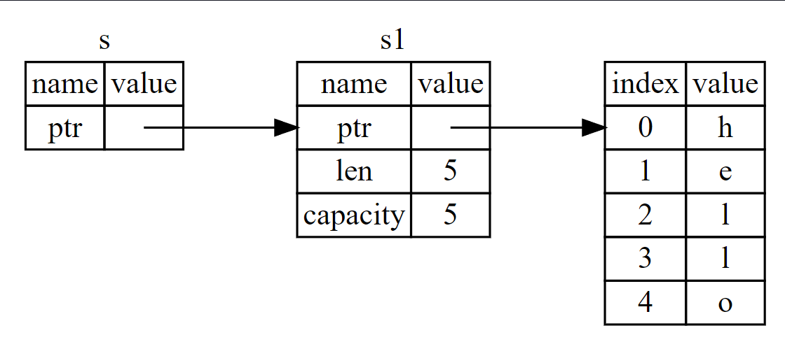

# References and Borrowing

````
fn main() {
    let s1 = String::from("hello");

    let (s2,len) = calculate_length (s1);

    println!("The length of '{}' is {}.", s2, len);
}

fn calculate_length (s: String) -> (String,usize) {
    let length = s.len();
    (s,length)
}
````

Yukarıda ki tuple koduyla ilgili sorun, String calculate_length çağrısından sonra String'i hala kullanabilmemiz
için String'i çağıran fonksiyona geri döndürmemiz gerektiğidir, çünkü String calculate_length içine taşınmıştır. Bunun
yerine, String değerine bir referans sağlayabiliriz. Bir referans, o adreste saklanan veriye erişmek için takip
edebileceğimiz bir adres olması bakımından bir pointer gibidir; bu veri başka bir değişkene aittir. Bir pointer'in
aksine, bir referansın, referansın ömrü boyunca belirli bir türdeki geçerli bir değeri göstermesi garanti edilir.

Değerin ownership'ini almak yerine parametre olarak bir nesneye referansı olan bir calculate_length fonksiyonunu şu
şekilde tanımlar ve kullanırsınız:

````
fn main() {
    let s1 = String::from("hello");

    let len = calculate_length(&s1);

    println!("Lenght of '{}' is {}", s1, len);
}

fn calculate_length(s: &String) -> usize {
    s.len()
}
````

İlk olarak, değişken bildirimindeki ve fonksiyon dönüş değerindeki tüm tuple kodunun gittiğine dikkat edin. İkinci
olarak, &s1'i calculate_length'e aktardığımıza ve tanımında String yerine &String aldığımıza dikkat edin. Bu ampersand
işaretleri referansları temsil eder ve bir değerin sahipliğini almadan ona atıfta bulunmanızı sağlar. Aşağıda ki şekil
bu kavramı göstermektedir



````
Not: & kullanarak referans vermenin tersi, dereferans operatörü olan * ile gerçekleştirilen dereferanstır. 
````

Buradaki fonksiyon çağrısına daha yakından bakalım:

````
let s1 = String::from("hello");

let len = calculate_length(&s1);
````

&s1 syntax'ı, s1 değerine başvuran ancak ona sahip olmayan bir başvuru oluşturmamızı sağlar. Referansın sahibi olmadığı
için, referans kullanılmayı bıraktığında işaret ettiği değer drop olmayacaktır.

Benzer şekilde, fonksiyonun imzasında s parametresinin türünün bir referans olduğunu belirtmek için & kullanılır. Bazı
açıklayıcı annotation'lar ekleyelim:

````
fn calculate_length(s: &String) -> usize { // s bir String'e referanstır
    s.len()
} // Burada, s scope dışına çıkar. Ancak refers'inda bulunduğu şeyin ownership'liğine sahip olmadığı için düşürülmez.
````

s değişkeninin geçerli olduğu scope herhangi bir fonksiyon parametresinin kapsamıyla aynıdır, ancak s'nin ownership'i
olmadığı için s'nin kullanımı sona erdiğinde referansın işaret ettiği değer düşmez. Fonksiyonlar gerçek değerler yerine
parametre olarak referanslara sahip olduğunda, ownership'i geri vermek için değerleri döndürmemiz gerekmeyecektir, çünkü
hiçbir zaman ownership'e sahip olmadık.

Referans oluşturma eylemine borrowing (ödünç alma) diyoruz. Gerçek hayatta olduğu gibi, bir kişi bir şeye sahipse, ondan
ödünç alabilirsiniz. İşiniz bittiğinde, geri vermek zorundasınız. Ona sahip değilsiniz.

Peki, ödünç aldığımız bir şeyi değiştirmeye çalışırsak ne olur? Aşağıda ki kodu inceleyelim

````
fn main() {
    let s1 = String::from("hello");
    change(&s1);
}

fn change(some_string : &String) {
    some_string.push_str("world");
}
````

İşte hata :

````
$ cargo run
   Compiling ownership v0.1.0 (file:///projects/ownership)
error[E0596]: cannot borrow `*some_string` as mutable, as it is behind a `&` reference
 --> src/main.rs:8:5
  |
7 | fn change(some_string: &String) {
  |                        ------- help: consider changing this to be a mutable reference: `&mut String`
8 |     some_string.push_str(", world");
  |     ^^^^^^^^^^^^^^^^^^^^^^^^^^^^^^^ `some_string` is a `&` reference, so the data it refers to cannot be borrowed as mutable

For more information about this error, try `rustc --explain E0596`.
error: could not compile `ownership` due to previous error

````

Variable'ların varsayılan olarak immutable olması gibi, referanslar da immutable'dır. Referansımız olan bir şeyi
değiştirmemize izin verilmez.

## Mutable References

Yukarıda ki hata veren kodu, borrowed (ödünç alınan) bir değeri değiştirmemize izin verecek şekilde, bunun yerine
değiştirilebilir bir referans kullanan birkaç küçük değişiklikle düzeltebiliriz:

````
fn main() {
    let mut s = String::from("hello");
    change(&mut s);
    print!("string : {}", s);
}

fn change(some_string : &mut String) {
    some_string.push_str(" world");
}
````

Önce s'yi mut olarak değiştiriyoruz. Daha sonra change fonksiyonunu çağırdığımız yerde &mut s ile mutable bir referans
oluşturuyoruz ve fonksiyon imzasını some_string: &mut String ile mutable bir referansı kabul edecek şekilde
güncelliyoruz. Bu, change fonksiyonunun barrowed (ödünç aldığı) değeri mutasyona uğratacağını çok açık hale getirir.

Mutable referansların büyük bir kısıtlaması vardır: bir değere mutable referansınız varsa, o değere başka referansınız
olamaz. s için iki adet değiştirilebilir referans oluşturmaya çalışan bu kod başarısız olacaktır:

````
fn main() {
    let mut s = String::from("hello");

    let r1 = &mut s;
    let r2 = &mut s;

    println!("{},{}", r1, r2);
}
````

Error :

````
$ cargo run
   Compiling ownership v0.1.0 (file:///projects/ownership)
error[E0499]: cannot borrow `s` as mutable more than once at a time
 --> src/main.rs:5:14
  |
4 |     let r1 = &mut s;
  |              ------ first mutable borrow occurs here
5 |     let r2 = &mut s;
  |              ^^^^^^ second mutable borrow occurs here
6 |
7 |     println!("{}, {}", r1, r2);
  |                        -- first borrow later used here

For more information about this error, try `rustc --explain E0499`.
error: could not compile `ownership` due to previous error

````

Bu hata, s değişkenini aynı anda birden fazla kez ödünç alamadığımız için bu kodun geçersiz olduğunu söylüyor. İlk
mutable ödünç alma r1'dedir ve println'de kullanılana kadar sürmelidir! Ancak bu mutable referansın oluşturulması ile
kullanımı arasında, r2'de r1 ile aynı verileri ödünç alan başka bir mutable referans oluşturmaya çalıştık.

Aynı anda aynı veriye birden fazla mutable referansı engelleyen kısıtlama, mutasyona izin verir, ancak çok
kontrollü bir şekilde. Bu, yeni Rustaceanların zorlandığı bir şeydir çünkü çoğu dil istediğiniz zaman mutasyon yapmanıza
izin verir. Bu kısıtlamaya sahip olmanın yararı, Rust'ın derleme zamanında race conditionları önleyebilmesidir. Data
Race, race condition'a benzer ve bu üç davranış gerçekleştiğinde meydana gelir:

* İki veya daha fazla pointer aynı veriye aynı anda erişir

* Pointer'lardan en az biri veriye yazmak için kullanılıyor

* Verilere erişimi senkronize etmek için kullanılan bir mekanizma yoktur

Data races tanımlanmamış davranışlara neden olur ve çalışma zamanında bunları izlemeye çalıştığınızda teşhis etmek
ve düzeltmek zor olabilir; Rust, data races olan kodu derlemeyi reddederek bu sorunu önler!

Her zaman olduğu gibi, yeni bir scope oluşturmak için küme parantezlerini kullanabiliriz, bu da birden fazla
mutable referansa izin verir, ancak aynı anda değil:

````
fn main() {
    let mut s = String::from("hello");
    
    {
        let r1 = &mut s;
    }

    let r2 = &mut s;
}
````

Rust, mutable ve immutable referansları birleştirmek için benzer bir kural uygular. Bu kod bir hata ile sonuçlanır:

````
fn main() {
    let mut s = String::from("hello");

    let r1 = &s; // problem yok
    let r2 = &s; // problem yok
    let r3 = &mut s; // PROBLEM

    println!("{}, {}, and {}", r1, r2, r3);
}
````

İşte hata :

````
$ cargo run
   Compiling ownership v0.1.0 (file:///projects/ownership)
error[E0502]: cannot borrow `s` as mutable because it is also borrowed as immutable
 --> src/main.rs:6:14
  |
4 |     let r1 = &s; // no problem
  |              -- immutable borrow occurs here
5 |     let r2 = &s; // no problem
6 |     let r3 = &mut s; // BIG PROBLEM
  |              ^^^^^^ mutable borrow occurs here
7 |
8 |     println!("{}, {}, and {}", r1, r2, r3);
  |                                -- immutable borrow later used here

For more information about this error, try `rustc --explain E0502`.
error: could not compile `ownership` due to previous error

````

Aynı değer için immutable bir referansımız varken mutable bir referansımız da olamaz.

Immutable bir referansı kullananlar, değerin aniden ellerinin altından değişmesini beklemezler! Bununla birlikte, birden
fazla Immutable referansa izin verilir çünkü veriyi sadece okuyan hiç kimse başka birinin veriyi okumasını etkileme
yeteneğine sahip değildir.

Bir referansın scope'unun tanıtıldığı yerden başladığını ve referansın son kullanıldığı zamana kadar devam ettiğini
unutmayın. Örneğin, bu kod derlenecektir çünkü immutable referansların son kullanımı olan println!, mutable
referansın tanıtılmasından önce gerçekleşir:

````
fn main() {
    let mut s = String::from("hello");

    let r1 = &s; // problem yok
    let r2 = &s; // problem yok
    println!("{} and {}", r1, r2);

    //r1 ve r2 değişkenleri bu noktadan sonra kullanılmayacaktır

    let r3 = &mut s; // problem yok
    println!("{}", r3);
}
````

Immutable r1 ve r2 referanslarının scope'ları, son kullanıldıkları println! noktasından sonra, yani mutable r3
referansı oluşturulmadan önce sona erer. Bu scope'lar çakışmaz, bu nedenle bu koda izin verilir: derleyici, scope'un
bitiminden önceki bir noktada referansın artık kullanılmadığını söyleyebilir.

Borrowing (Ödünç alma) hataları zaman zaman sinir bozucu olsa da, bunun Rust derleyicisinin potansiyel bir hatayı
erkenden (çalışma zamanında değil derleme zamanında) işaret etmesi ve sorunun tam olarak nerede olduğunu size göstermesi
olduğunu unutmayın. Böylece verilerinizin neden düşündüğünüz gibi olmadığını araştırmak zorunda kalmazsınız.

## Dangling (Sarkan) References

Pointer'ların kullanıldığı dillerde, bellekteki bir pointer'i korurken belleğin bir kısmını serbest bırakarak hatalı
bir şekilde dangling (sarkan) bir pointer (bellekte başka birine verilmiş olabilecek bir konuma referans veren bir
pointer) oluşturmak kolaydır. Buna karşın Rust'ta derleyici, referansların asla sarkan referanslar olmayacağını garanti
eder: eğer bir veriye referansınız varsa, derleyici veriye yapılan referanstan önce verinin scope dışına çıkmayacağını
garanti eder.

Rust'ın bunları derleme zamanı hatası ile nasıl önlediğini görmek için sarkan bir referans oluşturmayı deneyelim:

````
fn main() {
    let reference_to_nothing = dangle();
}

fn dangle() -> &String {
    let s = String::from("hello")
    &s
}
````

İşte hata :

````
$ cargo run
   Compiling ownership v0.1.0 (file:///projects/ownership)
error[E0106]: missing lifetime specifier
 --> src/main.rs:5:16
  |
5 | fn dangle() -> &String {
  |                ^ expected named lifetime parameter
  |
  = help: this function's return type contains a borrowed value, but there is no value for it to be borrowed from
help: consider using the `'static` lifetime
  |
5 | fn dangle() -> &'static String {
  |                 +++++++

For more information about this error, try `rustc --explain E0106`.
error: could not compile `ownership` due to previous error

````

Bu hata mesajı henüz ele almadığımız bir özellikten bahsediyor: lifetime. Lifetime'ları Bölüm 10'da ayrıntılı
olarak tartışacağız. Ancak, lifetime'lar ile ilgili kısımları göz ardı ederseniz, mesaj bu kodun neden bir sorun
olduğunun anahtarını içerir:

bu işlevin dönüş türü borrowed alınmış bir değer içerir, ancak barrowed alınması için değer yoktur

Şimdi dangle kodumuzun her aşamasında tam olarak neler olduğuna daha yakından bakalım:

````
fn dangle() -> &String { // dangle bir String'e referans döndürür
    let s = String::from("hello") // s yeni bir String
    &s // String'e bir referans döndürüyoruz, s
} // Burada, s scope dışına çıkar ve drop edilir. Hafızası silinir.
````

s, dangle içinde oluşturulduğu için, dangle'ın kodu bittiğinde s deallocate edilecektir. Ancak biz ona bir referans
döndürmeye çalıştık. Bu, bu referansın geçersiz bir String'e işaret edeceği anlamına gelir. Bu hiç iyi değil! Rust bunu
yapmamıza izin vermez.

Çözüm ise şu;

````
fn main() {
    let reference_to_nothing = dangle();
}

fn dangle() -> String {
    let s = String::from("hello");
    s
}
````

Bu herhangi bir sorun olmadan çalışır. Ownership dışarı move edilir ve hiçbir şey deallocated edilmez.

## Referans'ların Kuralları

* Herhangi bir zamanda, tek bir mutable referansa ya da istediğiniz sayıda immutable referansa sahip olabilirsiniz.

* Referanslar her zaman geçerli olmalıdır.