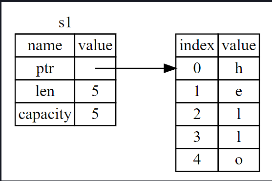
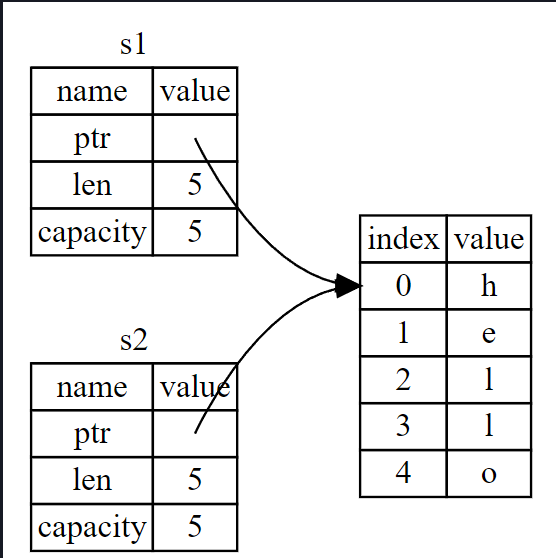
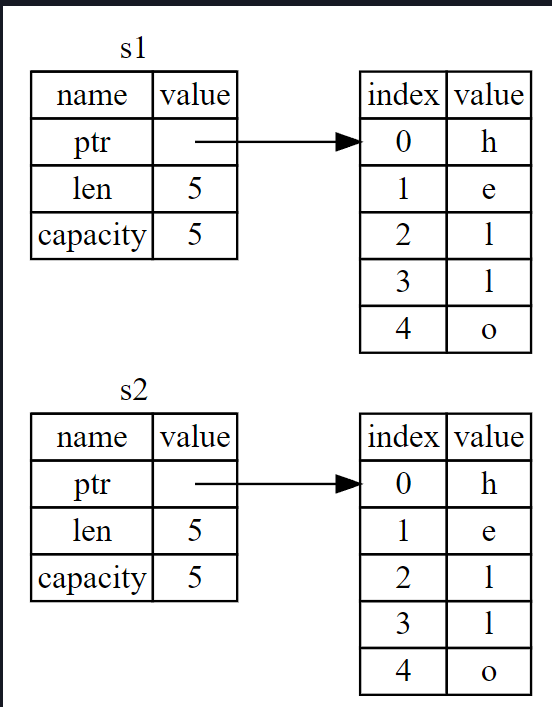
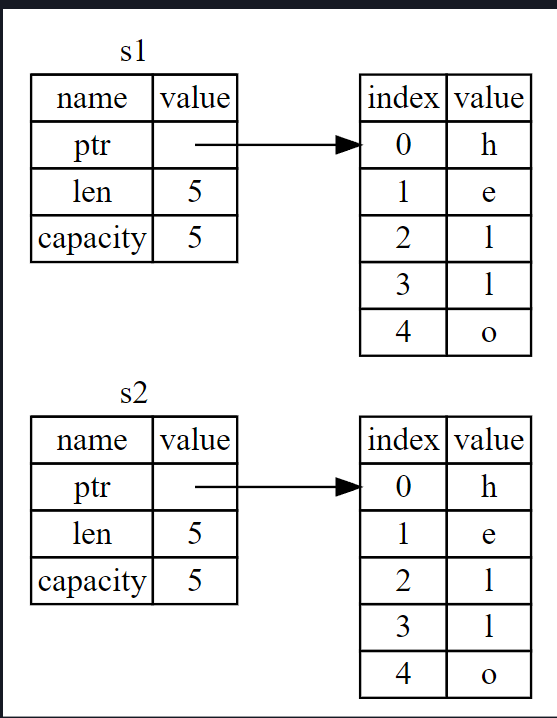

# Ownership nedir?

Ownership, bir Rust programının belleği nasıl yönettiğini düzenleyen bir dizi kuraldır. Tüm programlar çalışırken
bilgisayarın belleğini kullanma şeklini yönetmek zorundadır. Bazı dillerde, program çalışırken artık kullanılmayan
belleği düzenli olarak arayan çöp toplama sistemi vardır; diğer dillerde ise programcının belleği açıkça tahsis etmesi
ve boşaltması gerekir. Rust üçüncü bir yaklaşım kullanır: bellek, derleyicinin kontrol ettiği bir dizi kurala sahip bir
Ownership sistemi aracılığıyla yönetilir. Kurallardan herhangi biri ihlal edilirse, program derlenmez. Ownership
özelliklerinin hiçbiri programınızı çalışırken yavaşlatmaz.

Ownership birçok programcı için yeni bir kavram olduğundan, alışmak biraz zaman alır. İyi haber şu ki, Rust ve Ownership
sisteminin kuralları konusunda ne kadar deneyimli olursanız, doğal olarak güvenli ve verimli kod geliştirmeyi o kadar
kolay bulacaksınız. Devam edin!

Ownership'i anladığınızda, Rust'ı benzersiz kılan özellikleri anlamak için sağlam bir temele sahip olacaksınız. Bu
bölümde, çok yaygın bir veri yapısına odaklanan bazı örnekler üzerinde çalışarak Ownership'i öğreneceksiniz: stringler.

## Stack ve Heap

Birçok programlama dili stack ve heap hakkında çok sık düşünmenizi gerektirmez. Ancak Rust gibi bir sistem programlama
dilinde, bir değerin stack de mi yoksa heap de mi olduğu dilin nasıl davrandığını ve neden belirli kararlar vermeniz
gerektiğini etkiler. Ownership'in parçaları bu bölümün ilerleyen kısımlarında stack ve heap ile ilişkili olarak
açıklanacaktır, bu nedenle burada hazırlık için kısa bir açıklama bulunmaktadır.

Hem stack hem de heap, kodunuzun çalışma zamanında kullanabileceği bellek parçalarıdır, ancak farklı şekillerde
yapılandırılmışlardır. Stack, değerleri aldığı sırayla saklar ve değerleri ters sırayla siler. Bu, son giren ilk çıkar
olarak adlandırılır. Bir tabak yığını düşünün: daha fazla tabak eklediğinizde, onları yığının üstüne koyarsınız ve bir
tabağa ihtiyacınız olduğunda, üstten bir tane alırsınız. Ortadan veya alttan tabak eklemek veya çıkarmak pek işe
yaramaz! Veri eklemeye stack'e pushing, veriyi çıkarmaya ise stack'ten popping etme denir. Stack'de depolanan tüm
veriler bilinen, sabit bir boyuta sahip olmalıdır. Derleme zamanında boyutu bilinmeyen veya boyutu değişebilecek veriler
stack yerine heap'de saklanmalıdır.

Heap daha az düzenlidir: Heap'e veri koyduğunuzda, belirli bir miktar alan talep edersiniz. Bellek ayırıcı, stack'de
yeterince büyük boş bir nokta bulur, kullanımda olduğunu işaretler ve o konumun adresi olan bir pointer döndürür. Bu
işleme heap üzerinde allocating denir. (değerleri stack'e pushlamak allocating olarak kabul edilmez). Heap'in pointer'i
bilinen, sabit bir boyutta olduğu için pointer'i stack'de saklayabilirsiniz, ancak gerçek veriyi istediğinizde pointer'i
takip etmeniz gerekir. Bir restoranda oturduğunuzu düşünün. İçeri girdiğinizde, grubunuzdaki kişi sayısını belirtirsiniz
ve ev sahibi herkese uyan boş bir masa bulur ve sizi oraya yönlendirir. Grubunuzdan biri geç gelirse, sizi bulmak için
nereye oturduğunuzu sorabilir.

Stack'e push etmek, heap'de ayırmaktan daha hızlıdır çünkü allocator yeni verileri depolamak için asla bir yer aramak
zorunda kalmaz; bu konum her zaman stack'in en üstündedir. Buna kıyasla, heap'de yer ayırmak daha fazla çalışma
gerektirir çünkü allocator önce veriyi tutmak için yeterince büyük bir alan bulmalı ve ardından bir sonraki allocation'a
hazırlanmak için defter tutma işlemini gerçekleştirmelidir.

Heap'de ki verilere erişmek stack'de ki verilere erişmekten daha yavaştır çünkü oraya ulaşmak için bir pointer'i takip
etmeniz gerekir. Çağdaş işlemciler bellekte daha az atlama yaparlarsa daha hızlıdırlar. Benzetmeye devam edersek, bir
restoranda birçok masadan sipariş alan bir server'i düşünün. Bir sonraki masaya geçmeden önce bir masadaki tüm
siparişleri almak en verimli yöntemdir. A masasından bir sipariş almak, sonra B masasından bir sipariş almak, sonra
tekrar A'dan bir sipariş almak ve sonra tekrar B'den bir sipariş almak çok daha yavaş bir işlem olacaktır. Aynı şekilde,
bir işlemci daha uzaktaki (heap'de olabileceği gibi) veriler yerine diğer verilere yakın olan (stack'de olduğu gibi)
veriler üzerinde çalışırsa işini daha iyi yapabilir.

Kodunuz bir fonksiyonu çağırdığında, fonksiyona aktarılan değerler (potansiyel olarak heap üzerindeki verilere
pointer'lar da dahil olmak üzere) ve fonksiyonun local variable'ları stack'e pushlanır. İşlev sona erdiğinde, bu
değerler stack'den çıkarılır.

Kodun hangi bölümlerinin heap'de hangi verileri kullandığını takip etmek, heap'de ki yinelenen veri miktarını en aza
indirmek ve alanınızın tükenmemesi için heap'de ki kullanılmayan verileri temizlemek Ownership'in ele aldığı
sorunlardır.

Ownership'i anladıktan sonra, stack ve heap hakkında çok sık düşünmeniz gerekmeyecektir, ancak Ownership'in temel
amacının heap verilerini yönetmek olduğunu bilmek, neden bu şekilde çalıştığını açıklamaya yardımcı olabilir.

## Ownership Kuralları

İlk olarak, Ownership kurallarına bir göz atalım. Örnekler üzerinde çalışırken bu kuralları aklınızda tutun:

* Rust'taki her değerin bir Owner'i vardır.

* Aynı anda sadece bir Owner'i olabilir.

* Owner scope dışına çıktığında, değer düşecektir.

## Variable (Değişken) Scope

Artık temel Rust syntax'ına geçtiğimize göre, fn main() { kodunun tamamını örneklere dahil etmeyeceğiz, bu nedenle
takip ediyorsanız, aşağıdaki örnekleri manuel olarak bir main işlevinin içine koyduğunuzdan emin olun. Sonuç olarak,
örneklerimiz biraz daha kısa olacak ve şablon kod yerine gerçek ayrıntılara odaklanmamızı sağlayacak.

Ownership'in ilk örneği olarak, bazı değişkenlerin scope'una bakacağız. Scope, bir program içinde bir öğenin geçerli
olduğu aralıktır. Aşağıdaki değişkeni ele alalım:

````
{
    /* s burada geçerli değildir, henüz declare edilmemiştir */
    let s = "hello"; // s bu noktadan itibaren geçerlidir
    // s ile bir şeyler yap
} // bu kapsam artık sona ermiştir ve s artık geçerli değildir
````

Başka bir deyişle, burada zaman içinde iki önemli nokta vardır:

* s kapsama girdiğinde geçerlidir.

* Scope dışına çıkana kadar geçerli kalır.

Bu noktada, scope'lar ve variable'ların ne zaman geçerli olduğu arasındaki ilişki diğer programlama dillerindekine
benzer. Şimdi String tipini tanıtarak bu anlayışın üzerine inşa edeceğiz.

## String type

Ownership kurallarını göstermek için, Bölüm 3'ün "Veri Tipleri" bölümünde ele aldıklarımızdan daha karmaşık bir veri
tipine ihtiyacımız var. Daha önce ele alınan tipler bilinen bir boyuta sahiptir, stack'de saklanabilir ve scope'ları
sona erdiğinde stack'den çıkarılabilir ve kodun başka bir bölümünün aynı değeri farklı bir scope'da kullanması
gerektiğinde yeni, bağımsız bir instance oluşturmak için hızlı ve önemsiz bir şekilde kopyalanabilir. Ancak biz heap'de
depolanan verilere bakmak ve Rust'ın bu verileri ne zaman temizleyeceğini nasıl bildiğini keşfetmek istiyoruz ve String
türü buna harika bir örnektir.

String'in Ownership'le ilgili kısımlarına odaklanacağız. Bu hususlar, ister standart kütüphane tarafından sağlansın
ister sizin tarafınızdan oluşturulsun, diğer complex veri türleri için de geçerlidir. String'i Bölüm 8'de daha
derinlemesine tartışacağız.

Bir String değerinin programımıza sabit olarak kodlandığı String literal'leri daha önce görmüştük. String değişmezleri
kullanışlıdır, ancak metin kullanmak isteyebileceğimiz her durum için uygun değildir. Bunun bir nedeni değişmez
olmalarıdır. Bir diğeri ise kodumuzu yazarken her string değerinin bilinemeyeceğidir: örneğin, kullanıcı girdisini almak
ve saklamak istersek ne olur? Bu gibi durumlar için Rust, 'String' adında ikinci bir string türüne sahiptir. Bu tür,
heap üzerinde ayrılan verileri yönetir ve bu nedenle derleme zamanında bizim için bilinmeyen bir miktar metni
depolayabilir. Aşağıdaki gibi from fonksiyonunu kullanarak bir string literalden bir 'String' oluşturabilirsiniz:

````
fn main() {
    let s = String::from("hello");
}
````

Çift iki nokta :: operatörü, string_from gibi bir isim kullanmak yerine bu özel from fonksiyonunu String tipi altında
isimlendirmemizi sağlar. Bu sözdizimini Bölüm 5'teki "Metot Sözdizimi" bölümünde ve Bölüm 7'deki "Modül Ağacında Bir
Öğeye Başvurma Yolları" bölümünde modüllerle isimlendirme hakkında konuşurken daha fazla tartışacağız.

Bu tür bir string mutated edilebilir:

````
fn main() {
    let mut s = String::from("Hello");
    s.push_str(", world!"); // push_str() bir String'e bir literal (değişmez) ekler
}
````

Peki, buradaki fark nedir? Neden String mutasyona uğratılabilirken literaller (değişmezler) uğratılamıyor? Aradaki fark,
bu iki türün bellekle nasıl başa çıktığıdır.

Bir String literal söz konusu olduğunda, içeriği compile time da biliriz, bu nedenle metin doğrudan son
executable dosyaya kodlanır. String literallerin hızlı ve verimli olmasının nedeni budur. Ancak bu özellikler
yalnızca string literal'ın immutable olmasından kaynaklanır. Ne yazık ki, derleme sırasında boyutu bilinmeyen ve program
çalışırken boyutu değişebilecek her metin parçası için binary dosyaya bir bellek bloğu koyamayız.

String tipinde, değişebilir ve büyüyebilir bir metin parçasını desteklemek için, içeriği tutmak üzere heap üzerinde
derleme zamanında bilinmeyen bir miktar bellek ayırmamız gerekir. Bu şu anlama gelir:

* Memory, çalışma zamanında memory allocator'dan talep edilmelidir.

* String'imizle işimiz bittiğinde bu belleği allocator'a geri döndürmenin bir yoluna ihtiyacımız var.

Bu ilk kısım bizim tarafımızdan yapılır: String::from'u çağırdığımızda, implementasyonu ihtiyaç duyduğu belleği talep
eder. Bu, programlama dillerinde hemen hemen evrenseldir.

Ancak ikinci kısım farklıdır. Çöp toplayıcısı (GC) olan dillerde, GC artık kullanılmayan belleği takip eder ve temizler
ve bizim bunu düşünmemize gerek yoktur. GC'si olmayan çoğu dilde, belleğin artık kullanılmadığını tespit etmek ve tıpkı
bellek talep ederken yaptığımız gibi, onu açıkça serbest bırakmak için kod çağırmak bizim sorumluluğumuzdadır. Bunu
doğru bir şekilde yapmak tarihsel olarak zor bir programlama sorunu olmuştur. Eğer unutursak, belleği boşa harcamış
oluruz. Eğer çok erken yaparsak, geçersiz bir değişkene sahip oluruz. Eğer iki kez yaparsak, bu da bir hatadır. Tam
olarak bir allocate ile tam olarak bir free'yi eşleştirmemiz gerekir.

Rust farklı bir yol izler: bellek, ona sahip olan değişken kapsam dışına çıktığında otomatik olarak geri döndürülür.
İşte Liste 4-1'deki kapsam örneğimizin string literal yerine String kullanan bir versiyonu:

````
fn main() {
    {
        let s = String::from("Hello"); // s bu noktadan itibaren geçerlidir
        // s ile ilgili birşeyler yapın
    } // bu kapsam artık sona ermiştir ve s artık geçerli değildir
}
````

String'imizin ihtiyaç duyduğu belleği allocator'a geri verebileceğimiz doğal bir nokta vardır: s scope dışına
çıktığında. Bir değişken scope dışına çıktığında, Rust bizim için özel bir fonksiyon çağırır. Bu fonksiyon 'drop' olarak
adlandırılır ve String'in yazarının belleği geri döndürmek için kodu koyabileceği yerdir. Rust, drop fonksiyonunu
otomatik olarak küme parantezinin kapanışında çağırır.

Bu modelin Rust kodunun yazılma şekli üzerinde derin bir etkisi vardır. Şu anda basit görünebilir, ancak birden fazla
değişkenin heap üzerinde ayırdığımız verileri kullanmasını istediğimiz daha karmaşık durumlarda kodun davranışı
beklenmedik olabilir. Şimdi bu durumlardan bazılarını inceleyelim.

## Move ile Etkileşime Giren Değişkenler ve Veriler

Rust'ta birden fazla değişken aynı veri ile farklı şekillerde etkileşime girebilir. Liste 4-2'de bir tamsayı kullanan
bir örneğe bakalım.

````
fn main() {
    let x = 5;
    let y = x;
}
````

Bunun ne yaptığını muhtemelen tahmin edebiliriz: "5 değerini x'e bağla; sonra x'teki değerin bir kopyasını oluştur ve
onu y'ye bağla." Artık x ve y olmak üzere iki değişkenimiz var ve ikisi de 5'e eşit. Gerçekten de olan budur, çünkü
tamsayılar bilinen, sabit bir boyuta sahip basit değerlerdir ve bu iki 5 değeri stack'e push edilir.

Şimdi String versiyonuna bakalım:

````
fn main() {
    let s1 = String::from("Hello, World!");
    let s2 = s1;
}
````

Bu çok benzer görünüyor, bu nedenle çalışma şeklinin aynı olacağını varsayabiliriz: yani, ikinci satır s1'deki değerin
bir kopyasını oluşturacak ve onu s2'ye bağlayacaktır. Ancak olan tam olarak bu değildir.

Şekil 4-1'e bakarak, String'e örtülerin altında neler olduğunu görebilirsiniz. Bir String, solda gösterilen üç parçadan
oluşur: String'in içeriğini tutan belleğe bir pointer, bir len ve bir capacity. Bu veri grubu stack üzerinde
saklanır. Sağ tarafta ise heap üzerinde içeriği tutan bellek yer alır.



len, String'in içeriğinin şu anda bayt cinsinden ne kadar bellek kullandığını gösterir. Capacity, String'in
allocator'dan aldığı bayt cinsinden toplam bellek miktarıdır. len ve capacity arasındaki fark önemlidir, ancak bu
bağlamda değil, bu nedenle şimdilik capacity'i görmezden gelmek iyidir.

s1'i s2'ye atadığımızda, String verisi kopyalanır, yani pointer'i, len ve stack'de bulunan kapasiteyi kopyalarız.
Pointer'in başvurduğu heap üzerindeki verileri kopyalamayız. Başka bir deyişle, bellekteki veri gösterimi Şekil
4-2'deki gibi görünür.



Bu gösterim Şekil 4-3'e benzemez, eğer Rust bunun yerine heap verilerini de kopyalasaydı bellek bu şekilde görünürdü.
Rust bunu yapsaydı, s2 = s1 işlemi, heap'de ki veriler büyükse çalışma zamanı performansı açısından çok pahalı
olabilirdi.



Daha önce, bir değişken kapsam dışına çıktığında Rust'ın otomatik olarak drop fonksiyonunu çağırdığını ve bu değişken
için heap belleğini temizlediğini söylemiştik. Ancak Şekil 4-2, her iki veri pointer'inin de aynı konuma işaret
ettiğini göstermektedir. Bu bir sorundur: s2 ve s1 kapsam dışına çıktığında, her ikisi de aynı belleği boşaltmaya
çalışacaktır. Bu, double free error hatası olarak bilinir ve daha önce bahsettiğimiz bellek güvenliği hatalarından
biridir. Belleğin iki kez serbest bırakılması bellek bozulmasına yol açabilir ve bu da potansiyel olarak güvenlik
açıklarına neden olabilir.

Bellek güvenliğini sağlamak için, let s2 = s1; satırından sonra, Rust s1'i artık geçerli değil olarak kabul eder. Bu
nedenle, s1 kapsam dışına çıktığında Rust'ın herhangi bir şeyi serbest bırakması gerekmez. s2 oluşturulduktan sonra s1'i
kullanmaya çalıştığınızda ne olacağını kontrol edin; çalışmayacaktır:

````
fn main() {
    let s1 = String::from("Hello, World!");
    let s2 = s1;
    println!("{}", s1);
}
````

Bunun gibi bir hata alırsınız çünkü Rust geçersiz referansı kullanmanızı engeller:

````
$ cargo run
   Compiling ownership v0.1.0 (file:///projects/ownership)
error[E0382]: borrow of moved value: `s1`
 --> src/main.rs:5:28
  |
2 |     let s1 = String::from("hello");
  |         -- move occurs because `s1` has type `String`, which does not implement the `Copy` trait
3 |     let s2 = s1;
  |              -- value moved here
4 |
5 |     println!("{}, world!", s1);
  |                            ^^ value borrowed here after move
  |
  = note: this error originates in the macro `$crate::format_args_nl` which comes from the expansion of the macro 
  `println` (in Nightly builds, run with -Z macro-backtrace for more info)
help: consider cloning the value if the performance cost is acceptable
  |
3 |     let s2 = s1.clone();
  |                ++++++++

For more information about this error, try `rustc --explain E0382`.
error: could not compile `ownership` due to previous error
````

Diğer dillerle çalışırken shallow copy ve deep copy terimlerini duyduysanız, verileri kopyalamadan pointer'i, len
ve capacity'i kopyalama kavramı muhtemelen shallow copy yapmak gibi geliyordur. Ancak Rust ilk değişkeni de geçersiz
kıldığı için, shallow copy olarak adlandırılmak yerine, 'move' olarak bilinir. Bu örnekte, s1'in s2'ye taşındığını
söyleyebiliriz. Gerçekte ne olduğu Şekil 4-4'te gösterilmiştir.


Bu sorunumuzu çözer! Sadece s2 geçerliyken, kapsam dışına çıktığında tek başına belleği boşaltacak ve işimiz bitecek.

Buna ek olarak, bununla ima edilen bir tasarım seçimi vardır: Rust hiçbir zaman verilerinizin "deep" kopyalarını
otomatik olarak oluşturmaz. Bu nedenle, herhangi bir otomatik kopyalamanın çalışma zamanı performansı açısından ucuz
olduğu varsayılabilir.

## Clone ile Etkileşime Giren Variable'lar ve Data

Eğer String'in sadece stack verisini değil, heap verisini de deeply copy istiyorsak, clone adı verilen yaygın bir metodu
kullanabiliriz. Metot sözdizimini Bölüm 5'te tartışacağız, ancak metotlar birçok programlama dilinde ortak bir özellik
olduğundan, muhtemelen bunları daha önce görmüşsünüzdür.

İşte clone methodunun iş başında olduğu bir örnek:

````
fn main() {
    let s1 = String::from("Hello, World!");
    let s2 = s1.clone();
    println!("{}", s1);
    println!("{}", s2);
}
````

Bu gayet iyi çalışır ve Şekil aşağıda gösterilen, heap datasının kopyalandığı davranışı açıkça üretir.



Bir clone call'u gördüğünüzde, bazı rastgele kodların yürütüldüğünü ve bu kodun pahalı olabileceğini bilirsiniz. Bu,
farklı bir şeylerin döndüğünün görsel bir göstergesidir.

## Yalnızca Stack Data: Kopyala

Henüz bahsetmediğimiz başka bir sorun daha var. Bir kısmı aşağıda gösterilen tamsayıları kullanan bu kod çalışır ve
geçerlidir:

````
fn main() {
    let x = 5;
    let y = x;
    println!("X : {} & Y : {}", x, y);
}
````

Ancak bu kod az önce öğrendiklerimizle çelişiyor gibi görünüyor: clone call yok, ancak x hala geçerli ve y'ye move
edilmedi.

Bunun nedeni, derleme zamanında bilinen bir boyuta sahip olan tamsayılar gibi türlerin tamamen stack'de depolanmasıdır,
bu nedenle gerçek değerlerin kopyalarının oluşturulması hızlıdır. Başka bir deyişle, burada deep ve shallow kopyalama
arasında bir fark yoktur, bu nedenle clone'u çağırmak normal shallow kopyalamadan farklı bir şey yapmaz ve bunu dışarıda
bırakabiliriz.

Rust, tamsayılar gibi stack'de saklanan türlere yerleştirebileceğimiz Copy özelliği adı verilen özel bir annotation'a
sahiptir (Bölüm 10'da özellikler hakkında daha fazla konuşacağız). Bir tür Copy özelliğini implement ederse, onu
kullanan değişkenler move edilmez, bunun yerine önemsiz bir şekilde kopyalanır ve başka bir değişkene atandıktan sonra
hala geçerli olurlar.

Rust, tür veya türün herhangi bir parçası Drop özelliğini uyguladıysa, bir türe Copy ile annotation eklememize izin
vermez. Değer kapsam dışına çıktığında türün özel bir şey yapması gerekiyorsa ve bu türe Copy annotation'ını eklersek,
derleme zamanı hatası alırız. Özelliği uygulamak üzere türünüze Copy annotation'ını nasıl ekleyeceğinizi öğrenmek için
Ek C'deki “Derivable Traits (Türetilebilir Özellikler)" bölümüne bakın.

Peki, hangi türler Copy özelliğini implement eder? Emin olmak için ilgili türün belgelerini kontrol edebilirsiniz, ancak
genel bir kural olarak, basit scalar değerlerden oluşan herhangi bir grup Copy özelliğini implement edebilir ve tahsis
gerektiren veya bir tür kaynak olan hiçbir şey Copy özelliğini implement edemez. İşte Copy özelliğini uygulayan
türlerden bazıları:

* u32 gibi tüm tamsayı türleri.

* Boolean türü, bool, true ve false değerlerini içerir.

* f64 gibi tüm floating-point türleri

* Character type 'char'

* Tuple'lar, yalnızca Copy'yi de implement eden türleri içeriyorlarsa. Örneğin, (i32, i32) Copy'yi implement eder,
  ancak (i32, String) implement etmez

## Ownership ve Functions

Bir fonksiyona değer aktarma mekaniği, bir değişkene değer atama mekaniğine benzer. Bir değişkeni bir fonksiyona
geçirmek, tıpkı atamanın yaptığı gibi değişkeni taşır veya kopyalar. Aşağı da, değişkenlerin scope içine girdiği ve
scope dışına çıktığı yerleri gösteren bazı annotation'lar içeren bir örnek bulunmaktadır.

````
fn main() {
    let s = String::from("hello"); // s scope'a girer

    takes_ownership(s); // s'nin değeri fonksiyona taşınır...
    // ... ve bu yüzden artık burada 's' geçerli değil

    let x = 5; // x scope'a girer

    makes_copy(x); // x fonksiyonun içine doğru move edecektir,
    // ancak i32 Copy'dir, bu nedenle daha sonra hala x kullanmanızda sorun yoktur

} // burada x scope dışına çıkar

fn takes_ownership(some_string : String) { // some_string scope'a girer
    println!("incoming string : {some_string}")
} // Burada, some_string scope dışına çıkar ve `drop` çağrılır. Backing memory serbest bırakılır.

fn makes_copy(some_int : i32){ // some_int scopa'a girer
    println!("incoming integer : {some_int}");
} // Burada, some_integer kapsam dışına çıkar. Özel bir şey olmaz.
````

Eğer takes_ownership çağrısından sonra s kullanmaya çalışsaydık, Rust derleme zamanı hatası verirdi. Bu statik
kontroller bizi hatalardan korur. Bunları nerede kullanabileceğinizi ve ownership kurallarının bunu yapmanızı nerede
engellediğini görmek için main'e s ve x kullanan kod eklemeyi deneyin.

## Return Values ve Scope

Değer döndürmek de ownership'i aktarabilir.

````
fn main() {
    let _s1 = gives_ownership(); // gives_ownership return value'yu s1'e move eder

    let s2 = String::from("hello"); // s2 scope içine girer

    // s2 takes_and_gives_back içine taşınır, bu da dönüş değerini s3 içine taşır
    let s3 = takes_and_gives_back(s2);
} /* Burada, s3 scope dışına çıkar ve drop edilir. s2 move edildi, bu nedenle hiçbir şey olmaz.
s1 scope dışına çıkar ve drop edilir */

/* gives_ownership return value'sunu kendisini çağıran fonksiyona move edecektir*/
fn gives_ownership() -> String {
    let some_string = String::from("yours"); //some_string scope içine girer
    some_string // some_string döndürülür ve çağıran işleve move edilir
}

/* Bu fonksiyon bir String alır ve bir String döndürür */
fn takes_and_gives_back(a_string: String) -> String { // a_string scope içine girer
    a_string //  a_string döndürülür ve çağıran işleve move edilir
}
````

Bir değişkenin ownership'i her seferinde aynı modeli izler: bir değeri başka bir değişkene atamak onu move eder. Heap
üzerinde veri içeren bir değişken scope dışına çıktığında, verinin ownership'i başka bir değişkene move edilmediği
sürece değer 'drop' tarafından temizlenecektir.

Bu işe yarasa da, ownership almak ve ardından her function ile ownership'i geri vermek biraz sıkıcıdır. Ya bir
fonksiyonun bir değeri kullanmasına izin vermek ama ownership'ini almamak istiyorsak? Fonksiyonun gövdesinden
kaynaklanan ve geri döndürmek isteyebileceğimiz herhangi bir veriye ek olarak, tekrar kullanmak istediğimizde içeri
aktardığımız herhangi bir şeyin de geri aktarılması gerekmesi oldukça can sıkıcıdır.

Rust, aşağıda gösterildiği gibi bir tuple kullanarak birden fazla değer döndürmemize izin verir.

````
fn main() {
    let s1 = String::from("hello");

    let (s2,len) = calculate_length (s1);

    println!("The length of '{}' is {}.", s2, len);
}

fn calculate_length (s: String) -> (String,usize) {
    let length = s.len();
    (s,length)
}
````

Ancak bu çok fazla seremoni ve yaygın olması gereken bir kavram için çok fazla iş. Şanslıyız ki Rust'ta bir değeri
sahipliğini devretmeden kullanmak için 'referans' adı verilen bir özellik var.